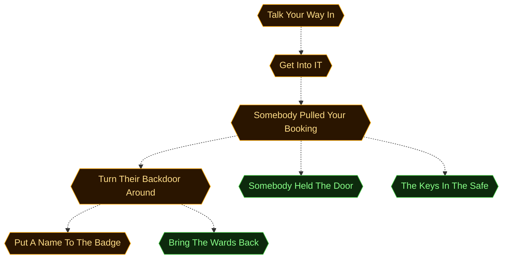
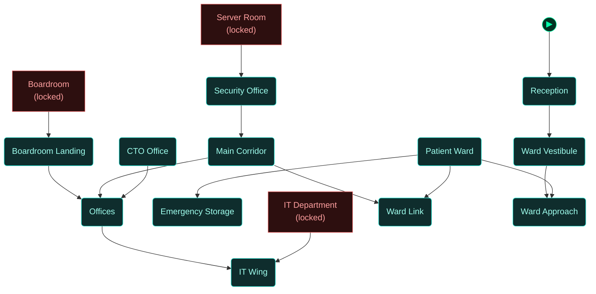

<!-- Auto-generated by scripts/generate_dungeon_graph.rb — do not edit by hand -->

# m02_ransomed_trust — Scenario Graph Reference

St. Catherine's Regional went dark at 02:47. Every clinical system is encrypted, forty-seven patients are running on backup generators, and the board votes on paying ENTROPY's ransom in four hours. You are in as an emergency security consultant -- which buys you a paper badge and nothing else, because the ransomware took the access control server too. Nobody in this building can grant you access. You will have to earn every door.

## Scenario Statistics

| Metric | Value |
|---|---|
| Story aims | 8 |
| Total tasks | 28 (3 optional) |
| VM flag challenges | 4 |
| Physical locks | 30 |
| AND-gate convergences | 0 |
| Rooms | 15 |
| Puzzle graph nodes / edges | 97 / 112 |
| Story graph nodes / edges | 8 / 7 |

## Critical Path

4 hops through story aims — minimum mandatory sequence to reach mission completion:

**Talk Your Way In → Get Into IT → Somebody Pulled Your Booking → Turn Their Backdoor Around → Put A Name To The Badge**

## How to Read These Diagrams

| Shape | Colour | Meaning |
|---|---|---|
| Rounded rectangle | Teal | Room / physical area |
| Rectangle | Red | Lock, barrier, or interactive terminal |
| Diamond | Orange | Inventory item or credential |
| Diamond | Red/Pink | NPC or physical key |
| Diamond | Purple | VM flag (challenge completion token) |
| Rectangle | Blue | VM challenge |
| Ribbon | Amber | NPC conversation / action gate |
| Hexagon | Green | Story aim (objective) |
| Hexagon | Amber | Critical path node |
| Circle | Grey | AND gate (all inputs required) |
| Subroutine rect `[[…]]` | Green | Container (holds items) |
| Rounded rectangle | Amber | NPC in room (Rooms & Contents only) |

Edges: `-->` solid = hard dependency; `-.->` dashed = soft / narrative dependency or optional path.

The `▶` node marks the player's starting room.

## Puzzle Graph

Physical lock–key dependency chain. Shows which items, codes, and NPC interactions are required to open each lock, and which locks gate access to each room or object. Use this to trace solvability, spot circular dependencies, and check that every key is reachable before the lock that needs it.

```mermaid
flowchart TD

  classDef room      fill:#0f2d2d,stroke:#22ddcc,color:#a0ffee
  classDef lock      fill:#2d0f0f,stroke:#e66060,color:#ffa0a0
  classDef key       fill:#2d0812,stroke:#e66060,color:#ffa0a0
  classDef item      fill:#2d1200,stroke:#e89030,color:#ffcc80
  classDef gate      fill:#111,stroke:#666,color:#eee
  classDef vm        fill:#0c1f40,stroke:#4a90d9,color:#a0c8ff
  classDef flag      fill:#1a0c2d,stroke:#9060d0,color:#cc99ff
  classDef action    fill:#1a1200,stroke:#cc9922,color:#ffee88
  classDef aim       fill:#0d2a0d,stroke:#44cc44,color:#88ff88
  classDef aim_gate  fill:#111111,stroke:#44cc44,color:#44cc44
  classDef container fill:#1a2d1a,stroke:#60b060,color:#a0e0a0
  classDef npc       fill:#2d1f0d,stroke:#d0a050,color:#ffe0a0
  classDef critical  fill:#2a1500,stroke:#ffaa00,color:#ffdd88
  classDef start     fill:#003322,stroke:#00ffaa,color:#00ffaa

  node_start(("▶"))
  node_start --> reception_lobby

  door_it_department["IT Department<br/>Key lock"]
  it_department("IT Department")
  door_server_room["Server Room<br/>RFID lock"]
  server_room("Server Room")
  door_conference_room["Boardroom<br/>PIN lock"]
  conference_room("Boardroom")
  reception_lobby("Reception")
  lock_pick_kit{"Lock Pick Kit"}
  lock_it_filing_cabinet["It Filing Cabinet"]
  reception_desk_visitor_log{"Reception Desk Visitor Log"}
  hospital_founding_plaque{"Hospital Founding Plaque"}
  lock_emergency_storage_safe["Emergency Storage Safe"]
  crisis_protocol_notice{"Crisis Protocol Notice"}
  lock_reception_terminal["Reception Workstation (Encrypted)<br/>Ransomware terminal"]
  reception_workstation_encrypted["Reception Workstation (Encrypted)"]
  npc_bernie_nwosu{"Bernie Nwosu"}
  it_department_override_key{"IT Department Override Key"}
  action_sign_in_at_reception>"Social engineer Bernie for the IT override key"]
  hospital_ward("Patient Ward")
  lock_ehr_terminal_ward["EHR Terminal (Offline)<br/>Ransomware terminal"]
  ehr_terminal_offline["EHR Terminal (Offline)"]
  npc_sister_doyle{"Sister Doyle"}
  bank_staff_lanyard{"Bank Staff Lanyard"}
  lock_lock_guard_challenge["Lock Guard Challenge"]
  action_talk_to_ward_nurse>"Hear from Sister Doyle what the outage costs -- and earn the safe code"]
  lock_infected_terminal["Infected Terminal<br/>Ransomware terminal"]
  infected_terminal{"Infected Terminal"}
  lock_gary_workstation["Gary's Workstation<br/>Password lock"]
  backup_server_ssh_notes{"Backup Server SSH Notes"}
  gary_s_workstation["Gary's Workstation"]
  printouts_on_gary_s_desk{"Printouts on Gary's Desk"}
  gary_s_password_sticky_note{"Gary's Password Sticky Note"}
  lock_vm_launcher_rooting_for_a_win["Vm Launcher Rooting For A Win"]
  photo_frame_emma_s_birthday{"Photo Frame - Emma's Birthday"}
  gary_s_email_archive_warning_7_of_7{"Gary's Email Archive -- Warning 7 of 7"}
  lock_lock_gary_cooperation["Lock Gary Cooperation"]
  dr_kim_s_reply_21_may{"Dr. Kim's Reply -- 21 May"}
  network_diagram_whiteboard{"Network Diagram Whiteboard"}
  planted_network_device{"Planted Network Device"}
  npc_gary_whitlock{"Gary Whitlock"}
  server_room_keycard{"Server Room Keycard"}
  spare_contractor_lanyard{"Spare Contractor Lanyard"}
  action_social_engineer_gary>"Win Gary over -- rapport, leverage, theft, or force"]
  vm_access_terminal["VM Access Terminal"]
  cyberchef_workstation{"CyberChef Workstation"}
  lock_hospital_recovery_console["Hospital Recovery Console"]
  recovery_instructions_encoded{"Recovery Instructions (Encoded)"}
  lock_entropy_staging_cache["ENTROPY Staging Cache<br/>Flag lock"]
  ghost_s_operational_manifesto{"Ghost's Operational Manifesto"}
  affiliate_handling_note{"Affiliate Handling Note"}
  entropy_staging_cache["ENTROPY Staging Cache"]
  emergency_equipment_storage("Emergency Storage")
  offline_backup_encryption_keys{"Offline Backup Encryption Keys"}
  pin_locked_safe["PIN-Locked Safe"]
  lock_entropy_field_case["Sealed Equipment Case<br/>Key lock"]
  pin_cracker{"PIN Cracker"}
  entropy_asset_tag{"ENTROPY Asset Tag"}
  sealed_equipment_case["Sealed Equipment Case"]
  dr_kim_office("CTO Office")
  lock_kim_office_terminal["CTO Workstation (Encrypted)<br/>Ransomware terminal"]
  cto_workstation_encrypted["CTO Workstation (Encrypted)"]
  dr_kim_s_desk_diary{"Dr. Kim's Desk Diary"}
  lock_dr_kim_s_safe["Dr. Kim's Safe<br/>PIN lock"]
  zero_day_syndicate_invoice{"Zero Day Syndicate Invoice"}
  npc_dr_sarah_kim{"Dr. Sarah Kim"}
  dr_kim_s_signed_statement{"Dr. Kim's Signed Statement"}
  action_meet_dr_kim>"Get Kim's verbal authorisation and the boardroom code"]
  ransomware_incorporated_proposal{"Ransomware Incorporated Proposal"}
  night_security_post_log{"Night Security Post Log"}
  lock_press_terminal["Hospital Communications Terminal"]
  security_office("Security Office")
  lock_security_desk_terminal["Security Desk Terminal (Encrypted)<br/>Ransomware terminal"]
  security_desk_terminal_encrypted["Security Desk Terminal (Encrypted)"]
  key_cabinet_empty{"Key Cabinet (Empty)"}
  night_rota{"Night Rota"}
  npc_val_okonkwo{"Val Okonkwo"}
  val_s_pocket_notebook{"Val's Pocket Notebook"}
  office_corridor("Main Corridor")
  ward_board{"Ward Board"}
  ward_approach("Ward Approach")
  nurse_s_handwritten_note{"Nurse's Handwritten Note"}
  vmch_submit_ssh_flag["Get a foothold on the backup server and submit the SSH flag"]
  vmfl_submit_ssh_flag{"Ssh Flag"}
  lock_proftpd_exploitation_unlocked["Proftpd Exploitation Unlocked"]
  vmch_submit_proftpd_flag["Exploit the ProFTPD backdoor and submit the flag"]
  vmfl_submit_proftpd_flag{"Proftpd Flag"}
  lock_database_backup_accessible["Database Backup Accessible"]
  vmch_submit_database_flag["Locate the encrypted database backup and submit the flag"]
  vmfl_submit_database_flag{"Database Flag"}
  vmch_submit_ghost_log_flag["Recover Ghost's operational log and submit the flag"]
  vmfl_submit_ghost_log_flag{"Ghost Log Flag"}
  lock_ghost_lore_unlocked["Ghost Lore Unlocked"]
  ward_vestibule("Ward Vestibule")
  ward_hall("Ward Link")
  office_hall_mid("Offices")
  office_hall_west("Boardroom Landing")
  office_hall_east("IT Wing")

  door_it_department --> it_department
  door_server_room --> server_room
  door_conference_room --> conference_room
  reception_lobby -.-> lock_pick_kit
  lock_pick_kit -.-> door_it_department
  lock_pick_kit -.-> lock_it_filing_cabinet
  reception_lobby --> reception_desk_visitor_log
  reception_lobby --> hospital_founding_plaque
  hospital_founding_plaque --> lock_emergency_storage_safe
  reception_lobby --> crisis_protocol_notice
  reception_lobby --> lock_reception_terminal
  reception_lobby --> reception_workstation_encrypted
  reception_lobby --> npc_bernie_nwosu
  npc_bernie_nwosu --> it_department_override_key
  it_department_override_key --> door_it_department
  npc_bernie_nwosu --> action_sign_in_at_reception
  hospital_ward --> lock_ehr_terminal_ward
  hospital_ward --> ehr_terminal_offline
  hospital_ward --> npc_sister_doyle
  npc_sister_doyle -.-> bank_staff_lanyard
  bank_staff_lanyard -.-> lock_lock_guard_challenge
  npc_sister_doyle --> action_talk_to_ward_nurse
  it_department --> lock_infected_terminal
  it_department --> infected_terminal
  it_department --> lock_gary_workstation
  lock_gary_workstation --> backup_server_ssh_notes
  it_department --> gary_s_workstation
  it_department --> printouts_on_gary_s_desk
  it_department -.-> gary_s_password_sticky_note
  gary_s_password_sticky_note -.-> lock_vm_launcher_rooting_for_a_win
  it_department --> photo_frame_emma_s_birthday
  it_department --> lock_it_filing_cabinet
  lock_it_filing_cabinet --> gary_s_email_archive_warning_7_of_7
  gary_s_email_archive_warning_7_of_7 --> lock_lock_gary_cooperation
  lock_it_filing_cabinet --> dr_kim_s_reply_21_may
  it_department --> network_diagram_whiteboard
  network_diagram_whiteboard --> lock_vm_launcher_rooting_for_a_win
  it_department --> planted_network_device
  it_department --> npc_gary_whitlock
  npc_gary_whitlock --> server_room_keycard
  server_room_keycard --> door_server_room
  npc_gary_whitlock -.-> spare_contractor_lanyard
  spare_contractor_lanyard -.-> lock_lock_guard_challenge
  npc_gary_whitlock --> action_social_engineer_gary
  server_room --> vm_access_terminal
  server_room --> cyberchef_workstation
  server_room --> lock_hospital_recovery_console
  server_room --> recovery_instructions_encoded
  server_room --> lock_entropy_staging_cache
  lock_entropy_staging_cache --> ghost_s_operational_manifesto
  lock_entropy_staging_cache --> affiliate_handling_note
  server_room --> entropy_staging_cache
  emergency_equipment_storage --> lock_emergency_storage_safe
  lock_emergency_storage_safe --> offline_backup_encryption_keys
  offline_backup_encryption_keys --> lock_hospital_recovery_console
  emergency_equipment_storage --> pin_locked_safe
  emergency_equipment_storage --> lock_entropy_field_case
  lock_entropy_field_case -.-> pin_cracker
  pin_cracker -.-> lock_emergency_storage_safe
  lock_entropy_field_case --> entropy_asset_tag
  emergency_equipment_storage -.-> sealed_equipment_case
  dr_kim_office --> lock_kim_office_terminal
  dr_kim_office --> cto_workstation_encrypted
  dr_kim_office -.-> dr_kim_s_desk_diary
  dr_kim_s_desk_diary -.-> lock_emergency_storage_safe
  dr_kim_s_desk_diary -.-> door_conference_room
  dr_kim_office --> lock_dr_kim_s_safe
  lock_dr_kim_s_safe --> zero_day_syndicate_invoice
  dr_kim_office --> npc_dr_sarah_kim
  npc_dr_sarah_kim -.-> dr_kim_s_signed_statement
  npc_dr_sarah_kim --> action_meet_dr_kim
  conference_room --> ransomware_incorporated_proposal
  conference_room --> night_security_post_log
  conference_room --> lock_press_terminal
  security_office --> lock_security_desk_terminal
  security_office --> security_desk_terminal_encrypted
  security_office --> key_cabinet_empty
  security_office --> night_rota
  security_office --> npc_val_okonkwo
  npc_val_okonkwo --> val_s_pocket_notebook
  office_corridor --> ward_board
  ward_approach -.-> nurse_s_handwritten_note
  nurse_s_handwritten_note -.-> lock_emergency_storage_safe
  vmch_submit_ssh_flag --> vmfl_submit_ssh_flag
  vmfl_submit_ssh_flag --> lock_proftpd_exploitation_unlocked
  vmch_submit_proftpd_flag --> vmfl_submit_proftpd_flag
  vmfl_submit_ssh_flag -.-> vmch_submit_proftpd_flag
  vmfl_submit_proftpd_flag --> lock_database_backup_accessible
  vmch_submit_database_flag --> vmfl_submit_database_flag
  vmfl_submit_proftpd_flag -.-> vmch_submit_database_flag
  vmfl_submit_database_flag --> lock_emergency_storage_safe
  vmch_submit_ghost_log_flag --> vmfl_submit_ghost_log_flag
  vmfl_submit_database_flag -.-> vmch_submit_ghost_log_flag
  vmfl_submit_ghost_log_flag --> lock_ghost_lore_unlocked
  vmfl_submit_ghost_log_flag --> lock_entropy_staging_cache
  lock_vm_launcher_rooting_for_a_win --> vm_access_terminal
  vm_access_terminal --> vmch_submit_ssh_flag
  reception_lobby --> ward_vestibule
  hospital_ward --> ward_approach
  hospital_ward --> ward_hall
  hospital_ward --> emergency_equipment_storage
  dr_kim_office --> office_hall_mid
  security_office --> office_corridor
  office_corridor --> ward_hall
  office_corridor --> office_hall_mid
  office_hall_west --> office_hall_mid
  office_hall_mid --> office_hall_east
  ward_vestibule --> ward_approach
  action_meet_dr_kim --> conference_room
  action_meet_dr_kim -.-> it_department
  vmfl_submit_ghost_log_flag --> lock_press_terminal
  lock_hospital_recovery_console --> lock_press_terminal

  class door_it_department,door_server_room,door_conference_room,lock_it_filing_cabinet,lock_emergency_storage_safe,lock_reception_terminal,reception_workstation_encrypted,lock_ehr_terminal_ward,ehr_terminal_offline,lock_lock_guard_challenge,lock_infected_terminal,lock_gary_workstation,gary_s_workstation,lock_vm_launcher_rooting_for_a_win,lock_lock_gary_cooperation,lock_hospital_recovery_console,lock_entropy_staging_cache,entropy_staging_cache,pin_locked_safe,lock_entropy_field_case,sealed_equipment_case,lock_kim_office_terminal,cto_workstation_encrypted,lock_dr_kim_s_safe,lock_press_terminal,lock_security_desk_terminal,security_desk_terminal_encrypted,lock_proftpd_exploitation_unlocked,lock_database_backup_accessible,lock_ghost_lore_unlocked lock
  class it_department,server_room,conference_room,reception_lobby,hospital_ward,emergency_equipment_storage,dr_kim_office,security_office,office_corridor,ward_approach,ward_vestibule,ward_hall,office_hall_mid,office_hall_west,office_hall_east room
  class lock_pick_kit,reception_desk_visitor_log,hospital_founding_plaque,crisis_protocol_notice,infected_terminal,backup_server_ssh_notes,printouts_on_gary_s_desk,gary_s_password_sticky_note,photo_frame_emma_s_birthday,gary_s_email_archive_warning_7_of_7,dr_kim_s_reply_21_may,network_diagram_whiteboard,planted_network_device,cyberchef_workstation,recovery_instructions_encoded,ghost_s_operational_manifesto,affiliate_handling_note,pin_cracker,entropy_asset_tag,dr_kim_s_desk_diary,zero_day_syndicate_invoice,dr_kim_s_signed_statement,ransomware_incorporated_proposal,night_security_post_log,key_cabinet_empty,night_rota,val_s_pocket_notebook,ward_board,nurse_s_handwritten_note item
  class npc_bernie_nwosu,it_department_override_key,npc_sister_doyle,bank_staff_lanyard,npc_gary_whitlock,server_room_keycard,spare_contractor_lanyard,offline_backup_encryption_keys,npc_dr_sarah_kim,npc_val_okonkwo key
  class action_sign_in_at_reception,action_talk_to_ward_nurse,action_social_engineer_gary,action_meet_dr_kim action
  class vm_access_terminal,vmch_submit_ssh_flag,vmch_submit_proftpd_flag,vmch_submit_database_flag,vmch_submit_ghost_log_flag vm
  class vmfl_submit_ssh_flag,vmfl_submit_proftpd_flag,vmfl_submit_database_flag,vmfl_submit_ghost_log_flag flag

  classDef optional stroke-dasharray:5 2
  class lock_pick_kit,bank_staff_lanyard,gary_s_password_sticky_note,spare_contractor_lanyard,pin_cracker,sealed_equipment_case,dr_kim_s_desk_diary,dr_kim_s_signed_statement,nurse_s_handwritten_note optional
  class node_start start
```



## Story Aims

Narrative objective flow. Shows story aims and their unlock conditions. Critical path aims are highlighted in amber. Use this to check aim sequencing, identify gaps between objectives, and verify that the player always has a clear next goal.



## Story + Puzzle (Integrated)

Puzzle graph and story aims combined, with bridge edges connecting physical puzzle progress to story aim completion. Use this to verify that physical actions drive narrative progress and that no aim is left floating without a puzzle prerequisite.

```mermaid
flowchart TD

  classDef room      fill:#0f2d2d,stroke:#22ddcc,color:#a0ffee
  classDef lock      fill:#2d0f0f,stroke:#e66060,color:#ffa0a0
  classDef key       fill:#2d0812,stroke:#e66060,color:#ffa0a0
  classDef item      fill:#2d1200,stroke:#e89030,color:#ffcc80
  classDef gate      fill:#111,stroke:#666,color:#eee
  classDef vm        fill:#0c1f40,stroke:#4a90d9,color:#a0c8ff
  classDef flag      fill:#1a0c2d,stroke:#9060d0,color:#cc99ff
  classDef action    fill:#1a1200,stroke:#cc9922,color:#ffee88
  classDef aim       fill:#0d2a0d,stroke:#44cc44,color:#88ff88
  classDef aim_gate  fill:#111111,stroke:#44cc44,color:#44cc44
  classDef container fill:#1a2d1a,stroke:#60b060,color:#a0e0a0
  classDef npc       fill:#2d1f0d,stroke:#d0a050,color:#ffe0a0
  classDef critical  fill:#2a1500,stroke:#ffaa00,color:#ffdd88
  classDef start     fill:#003322,stroke:#00ffaa,color:#00ffaa

  node_start(("▶"))
  node_start --> reception_lobby

  door_it_department["IT Department<br/>Key lock"]
  it_department("IT Department")
  door_server_room["Server Room<br/>RFID lock"]
  server_room("Server Room")
  door_conference_room["Boardroom<br/>PIN lock"]
  conference_room("Boardroom")
  reception_lobby("Reception")
  lock_pick_kit{"Lock Pick Kit"}
  lock_it_filing_cabinet["It Filing Cabinet"]
  reception_desk_visitor_log{"Reception Desk Visitor Log"}
  hospital_founding_plaque{"Hospital Founding Plaque"}
  lock_emergency_storage_safe["Emergency Storage Safe"]
  crisis_protocol_notice{"Crisis Protocol Notice"}
  lock_reception_terminal["Reception Workstation (Encrypted)<br/>Ransomware terminal"]
  reception_workstation_encrypted["Reception Workstation (Encrypted)"]
  npc_bernie_nwosu{"Bernie Nwosu"}
  it_department_override_key{"IT Department Override Key"}
  action_sign_in_at_reception>"Social engineer Bernie for the IT override key"]
  hospital_ward("Patient Ward")
  lock_ehr_terminal_ward["EHR Terminal (Offline)<br/>Ransomware terminal"]
  ehr_terminal_offline["EHR Terminal (Offline)"]
  npc_sister_doyle{"Sister Doyle"}
  bank_staff_lanyard{"Bank Staff Lanyard"}
  lock_lock_guard_challenge["Lock Guard Challenge"]
  action_talk_to_ward_nurse>"Hear from Sister Doyle what the outage costs -- and earn the safe code"]
  lock_infected_terminal["Infected Terminal<br/>Ransomware terminal"]
  infected_terminal{"Infected Terminal"}
  lock_gary_workstation["Gary's Workstation<br/>Password lock"]
  backup_server_ssh_notes{"Backup Server SSH Notes"}
  gary_s_workstation["Gary's Workstation"]
  printouts_on_gary_s_desk{"Printouts on Gary's Desk"}
  gary_s_password_sticky_note{"Gary's Password Sticky Note"}
  lock_vm_launcher_rooting_for_a_win["Vm Launcher Rooting For A Win"]
  photo_frame_emma_s_birthday{"Photo Frame - Emma's Birthday"}
  gary_s_email_archive_warning_7_of_7{"Gary's Email Archive -- Warning 7 of 7"}
  lock_lock_gary_cooperation["Lock Gary Cooperation"]
  dr_kim_s_reply_21_may{"Dr. Kim's Reply -- 21 May"}
  network_diagram_whiteboard{"Network Diagram Whiteboard"}
  planted_network_device{"Planted Network Device"}
  npc_gary_whitlock{"Gary Whitlock"}
  server_room_keycard{"Server Room Keycard"}
  spare_contractor_lanyard{"Spare Contractor Lanyard"}
  action_social_engineer_gary>"Win Gary over -- rapport, leverage, theft, or force"]
  vm_access_terminal["VM Access Terminal"]
  cyberchef_workstation{"CyberChef Workstation"}
  lock_hospital_recovery_console["Hospital Recovery Console"]
  recovery_instructions_encoded{"Recovery Instructions (Encoded)"}
  lock_entropy_staging_cache["ENTROPY Staging Cache<br/>Flag lock"]
  ghost_s_operational_manifesto{"Ghost's Operational Manifesto"}
  affiliate_handling_note{"Affiliate Handling Note"}
  entropy_staging_cache["ENTROPY Staging Cache"]
  emergency_equipment_storage("Emergency Storage")
  offline_backup_encryption_keys{"Offline Backup Encryption Keys"}
  pin_locked_safe["PIN-Locked Safe"]
  lock_entropy_field_case["Sealed Equipment Case<br/>Key lock"]
  pin_cracker{"PIN Cracker"}
  entropy_asset_tag{"ENTROPY Asset Tag"}
  sealed_equipment_case["Sealed Equipment Case"]
  dr_kim_office("CTO Office")
  lock_kim_office_terminal["CTO Workstation (Encrypted)<br/>Ransomware terminal"]
  cto_workstation_encrypted["CTO Workstation (Encrypted)"]
  dr_kim_s_desk_diary{"Dr. Kim's Desk Diary"}
  lock_dr_kim_s_safe["Dr. Kim's Safe<br/>PIN lock"]
  zero_day_syndicate_invoice{"Zero Day Syndicate Invoice"}
  npc_dr_sarah_kim{"Dr. Sarah Kim"}
  dr_kim_s_signed_statement{"Dr. Kim's Signed Statement"}
  action_meet_dr_kim>"Get Kim's verbal authorisation and the boardroom code"]
  ransomware_incorporated_proposal{"Ransomware Incorporated Proposal"}
  night_security_post_log{"Night Security Post Log"}
  lock_press_terminal["Hospital Communications Terminal"]
  security_office("Security Office")
  lock_security_desk_terminal["Security Desk Terminal (Encrypted)<br/>Ransomware terminal"]
  security_desk_terminal_encrypted["Security Desk Terminal (Encrypted)"]
  key_cabinet_empty{"Key Cabinet (Empty)"}
  night_rota{"Night Rota"}
  npc_val_okonkwo{"Val Okonkwo"}
  val_s_pocket_notebook{"Val's Pocket Notebook"}
  office_corridor("Main Corridor")
  ward_board{"Ward Board"}
  ward_approach("Ward Approach")
  nurse_s_handwritten_note{"Nurse's Handwritten Note"}
  vmch_submit_ssh_flag["Get a foothold on the backup server and submit the SSH flag"]
  vmfl_submit_ssh_flag{"Ssh Flag"}
  lock_proftpd_exploitation_unlocked["Proftpd Exploitation Unlocked"]
  vmch_submit_proftpd_flag["Exploit the ProFTPD backdoor and submit the flag"]
  vmfl_submit_proftpd_flag{"Proftpd Flag"}
  lock_database_backup_accessible["Database Backup Accessible"]
  vmch_submit_database_flag["Locate the encrypted database backup and submit the flag"]
  vmfl_submit_database_flag{"Database Flag"}
  vmch_submit_ghost_log_flag["Recover Ghost's operational log and submit the flag"]
  vmfl_submit_ghost_log_flag{"Ghost Log Flag"}
  lock_ghost_lore_unlocked["Ghost Lore Unlocked"]
  ward_vestibule("Ward Vestibule")
  ward_hall("Ward Link")
  office_hall_mid("Offices")
  office_hall_west("Boardroom Landing")
  office_hall_east("IT Wing")
  aim_infiltrate_hospital{{"Talk Your Way In"}}
  aim_access_it_systems{{"Get Into IT"}}
  aim_cover_compromised{{"Somebody Pulled Your Booking"}}
  aim_exploit_entropy_backdoor{{"Turn Their Backdoor Around"}}
  aim_unmask_inside_asset{{"Somebody Held The Door"}}
  aim_identify_inside_asset{{"Put A Name To The Badge"}}
  aim_recover_offline_keys{{"The Keys In The Safe"}}
  aim_restore_hospital_systems{{"Bring The Wards Back"}}

  door_it_department --> it_department
  door_server_room --> server_room
  door_conference_room --> conference_room
  reception_lobby -.-> lock_pick_kit
  lock_pick_kit -.-> door_it_department
  lock_pick_kit -.-> lock_it_filing_cabinet
  reception_lobby --> reception_desk_visitor_log
  reception_lobby --> hospital_founding_plaque
  hospital_founding_plaque --> lock_emergency_storage_safe
  reception_lobby --> crisis_protocol_notice
  reception_lobby --> lock_reception_terminal
  reception_lobby --> reception_workstation_encrypted
  reception_lobby --> npc_bernie_nwosu
  npc_bernie_nwosu --> it_department_override_key
  it_department_override_key --> door_it_department
  npc_bernie_nwosu --> action_sign_in_at_reception
  hospital_ward --> lock_ehr_terminal_ward
  hospital_ward --> ehr_terminal_offline
  hospital_ward --> npc_sister_doyle
  npc_sister_doyle -.-> bank_staff_lanyard
  bank_staff_lanyard -.-> lock_lock_guard_challenge
  npc_sister_doyle --> action_talk_to_ward_nurse
  it_department --> lock_infected_terminal
  it_department --> infected_terminal
  it_department --> lock_gary_workstation
  lock_gary_workstation --> backup_server_ssh_notes
  it_department --> gary_s_workstation
  it_department --> printouts_on_gary_s_desk
  it_department -.-> gary_s_password_sticky_note
  gary_s_password_sticky_note -.-> lock_vm_launcher_rooting_for_a_win
  it_department --> photo_frame_emma_s_birthday
  it_department --> lock_it_filing_cabinet
  lock_it_filing_cabinet --> gary_s_email_archive_warning_7_of_7
  gary_s_email_archive_warning_7_of_7 --> lock_lock_gary_cooperation
  lock_it_filing_cabinet --> dr_kim_s_reply_21_may
  it_department --> network_diagram_whiteboard
  network_diagram_whiteboard --> lock_vm_launcher_rooting_for_a_win
  it_department --> planted_network_device
  it_department --> npc_gary_whitlock
  npc_gary_whitlock --> server_room_keycard
  server_room_keycard --> door_server_room
  npc_gary_whitlock -.-> spare_contractor_lanyard
  spare_contractor_lanyard -.-> lock_lock_guard_challenge
  npc_gary_whitlock --> action_social_engineer_gary
  server_room --> vm_access_terminal
  server_room --> cyberchef_workstation
  server_room --> lock_hospital_recovery_console
  server_room --> recovery_instructions_encoded
  server_room --> lock_entropy_staging_cache
  lock_entropy_staging_cache --> ghost_s_operational_manifesto
  lock_entropy_staging_cache --> affiliate_handling_note
  server_room --> entropy_staging_cache
  emergency_equipment_storage --> lock_emergency_storage_safe
  lock_emergency_storage_safe --> offline_backup_encryption_keys
  offline_backup_encryption_keys --> lock_hospital_recovery_console
  emergency_equipment_storage --> pin_locked_safe
  emergency_equipment_storage --> lock_entropy_field_case
  lock_entropy_field_case -.-> pin_cracker
  pin_cracker -.-> lock_emergency_storage_safe
  lock_entropy_field_case --> entropy_asset_tag
  emergency_equipment_storage -.-> sealed_equipment_case
  dr_kim_office --> lock_kim_office_terminal
  dr_kim_office --> cto_workstation_encrypted
  dr_kim_office -.-> dr_kim_s_desk_diary
  dr_kim_s_desk_diary -.-> lock_emergency_storage_safe
  dr_kim_s_desk_diary -.-> door_conference_room
  dr_kim_office --> lock_dr_kim_s_safe
  lock_dr_kim_s_safe --> zero_day_syndicate_invoice
  dr_kim_office --> npc_dr_sarah_kim
  npc_dr_sarah_kim -.-> dr_kim_s_signed_statement
  npc_dr_sarah_kim --> action_meet_dr_kim
  conference_room --> ransomware_incorporated_proposal
  conference_room --> night_security_post_log
  conference_room --> lock_press_terminal
  security_office --> lock_security_desk_terminal
  security_office --> security_desk_terminal_encrypted
  security_office --> key_cabinet_empty
  security_office --> night_rota
  security_office --> npc_val_okonkwo
  npc_val_okonkwo --> val_s_pocket_notebook
  office_corridor --> ward_board
  ward_approach -.-> nurse_s_handwritten_note
  nurse_s_handwritten_note -.-> lock_emergency_storage_safe
  vmch_submit_ssh_flag --> vmfl_submit_ssh_flag
  vmfl_submit_ssh_flag --> lock_proftpd_exploitation_unlocked
  vmch_submit_proftpd_flag --> vmfl_submit_proftpd_flag
  vmfl_submit_ssh_flag -.-> vmch_submit_proftpd_flag
  vmfl_submit_proftpd_flag --> lock_database_backup_accessible
  vmch_submit_database_flag --> vmfl_submit_database_flag
  vmfl_submit_proftpd_flag -.-> vmch_submit_database_flag
  vmfl_submit_database_flag --> lock_emergency_storage_safe
  vmch_submit_ghost_log_flag --> vmfl_submit_ghost_log_flag
  vmfl_submit_database_flag -.-> vmch_submit_ghost_log_flag
  vmfl_submit_ghost_log_flag --> lock_ghost_lore_unlocked
  vmfl_submit_ghost_log_flag --> lock_entropy_staging_cache
  lock_vm_launcher_rooting_for_a_win --> vm_access_terminal
  vm_access_terminal --> vmch_submit_ssh_flag
  reception_lobby --> ward_vestibule
  hospital_ward --> ward_approach
  hospital_ward --> ward_hall
  hospital_ward --> emergency_equipment_storage
  dr_kim_office --> office_hall_mid
  security_office --> office_corridor
  office_corridor --> ward_hall
  office_corridor --> office_hall_mid
  office_hall_west --> office_hall_mid
  office_hall_mid --> office_hall_east
  ward_vestibule --> ward_approach
  action_meet_dr_kim --> conference_room
  action_meet_dr_kim -.-> it_department
  vmfl_submit_ghost_log_flag --> lock_press_terminal
  lock_hospital_recovery_console --> lock_press_terminal
  aim_infiltrate_hospital -.-> aim_access_it_systems
  aim_access_it_systems -.-> aim_cover_compromised
  aim_cover_compromised -.-> aim_exploit_entropy_backdoor
  aim_cover_compromised -.-> aim_unmask_inside_asset
  aim_exploit_entropy_backdoor -.-> aim_identify_inside_asset
  aim_cover_compromised -.-> aim_recover_offline_keys
  aim_exploit_entropy_backdoor -.-> aim_restore_hospital_systems
  reception_lobby -.-> aim_infiltrate_hospital
  hospital_ward -.-> aim_infiltrate_hospital
  door_it_department -.-> aim_access_it_systems
  door_server_room -.-> aim_cover_compromised
  vmfl_submit_ssh_flag -.-> aim_exploit_entropy_backdoor
  vmfl_submit_proftpd_flag -.-> aim_exploit_entropy_backdoor
  vmfl_submit_database_flag -.-> aim_exploit_entropy_backdoor
  vmfl_submit_ghost_log_flag -.-> aim_exploit_entropy_backdoor
  emergency_equipment_storage -.-> aim_recover_offline_keys
  lock_emergency_storage_safe -.-> aim_recover_offline_keys
  action_sign_in_at_reception -.-> aim_access_it_systems
  action_talk_to_ward_nurse -.-> aim_recover_offline_keys
  action_social_engineer_gary -.-> aim_cover_compromised
  action_meet_dr_kim -.-> aim_access_it_systems
  reception_desk_visitor_log -.-> aim_cover_compromised
  reception_workstation_encrypted -.-> aim_infiltrate_hospital
  ehr_terminal_offline -.-> aim_infiltrate_hospital
  vm_access_terminal -.-> aim_exploit_entropy_backdoor
  lock_hospital_recovery_console -.-> aim_restore_hospital_systems
  entropy_staging_cache -.-> aim_unmask_inside_asset
  pin_locked_safe -.-> aim_recover_offline_keys
  sealed_equipment_case -.-> aim_recover_offline_keys
  cto_workstation_encrypted -.-> aim_infiltrate_hospital
  ransomware_incorporated_proposal -.-> aim_unmask_inside_asset
  night_security_post_log -.-> aim_identify_inside_asset
  lock_press_terminal -.-> aim_restore_hospital_systems
  security_desk_terminal_encrypted -.-> aim_cover_compromised
  night_rota -.-> aim_unmask_inside_asset

  class door_it_department,door_server_room,door_conference_room,lock_it_filing_cabinet,lock_emergency_storage_safe,lock_reception_terminal,reception_workstation_encrypted,lock_ehr_terminal_ward,ehr_terminal_offline,lock_lock_guard_challenge,lock_infected_terminal,lock_gary_workstation,gary_s_workstation,lock_vm_launcher_rooting_for_a_win,lock_lock_gary_cooperation,lock_hospital_recovery_console,lock_entropy_staging_cache,entropy_staging_cache,pin_locked_safe,lock_entropy_field_case,sealed_equipment_case,lock_kim_office_terminal,cto_workstation_encrypted,lock_dr_kim_s_safe,lock_press_terminal,lock_security_desk_terminal,security_desk_terminal_encrypted,lock_proftpd_exploitation_unlocked,lock_database_backup_accessible,lock_ghost_lore_unlocked lock
  class it_department,server_room,conference_room,reception_lobby,hospital_ward,emergency_equipment_storage,dr_kim_office,security_office,office_corridor,ward_approach,ward_vestibule,ward_hall,office_hall_mid,office_hall_west,office_hall_east room
  class lock_pick_kit,reception_desk_visitor_log,hospital_founding_plaque,crisis_protocol_notice,infected_terminal,backup_server_ssh_notes,printouts_on_gary_s_desk,gary_s_password_sticky_note,photo_frame_emma_s_birthday,gary_s_email_archive_warning_7_of_7,dr_kim_s_reply_21_may,network_diagram_whiteboard,planted_network_device,cyberchef_workstation,recovery_instructions_encoded,ghost_s_operational_manifesto,affiliate_handling_note,pin_cracker,entropy_asset_tag,dr_kim_s_desk_diary,zero_day_syndicate_invoice,dr_kim_s_signed_statement,ransomware_incorporated_proposal,night_security_post_log,key_cabinet_empty,night_rota,val_s_pocket_notebook,ward_board,nurse_s_handwritten_note item
  class npc_bernie_nwosu,it_department_override_key,npc_sister_doyle,bank_staff_lanyard,npc_gary_whitlock,server_room_keycard,spare_contractor_lanyard,offline_backup_encryption_keys,npc_dr_sarah_kim,npc_val_okonkwo key
  class action_sign_in_at_reception,action_talk_to_ward_nurse,action_social_engineer_gary,action_meet_dr_kim action
  class vm_access_terminal,vmch_submit_ssh_flag,vmch_submit_proftpd_flag,vmch_submit_database_flag,vmch_submit_ghost_log_flag vm
  class vmfl_submit_ssh_flag,vmfl_submit_proftpd_flag,vmfl_submit_database_flag,vmfl_submit_ghost_log_flag flag
  class aim_infiltrate_hospital,aim_access_it_systems,aim_cover_compromised,aim_exploit_entropy_backdoor,aim_identify_inside_asset critical
  class aim_unmask_inside_asset,aim_recover_offline_keys,aim_restore_hospital_systems aim

  classDef optional stroke-dasharray:5 2
  class lock_pick_kit,bank_staff_lanyard,gary_s_password_sticky_note,spare_contractor_lanyard,pin_cracker,sealed_equipment_case,dr_kim_s_desk_diary,dr_kim_s_signed_statement,nurse_s_handwritten_note optional
  class node_start start
```

## Rooms

Physical room layout with all connections. Locked rooms are shown in red. Use this to check room reachability, identify dead-end rooms with no content, and understand the spatial structure of the scenario.



## Rooms & Contents

Physical room layout with all objects, containers, NPCs, and held items. Use this to check clue distribution across rooms, verify that hints are placed before the locks they solve, and spot rooms that are under- or over-loaded with content.

```mermaid
flowchart TD

  classDef room      fill:#0f2d2d,stroke:#22ddcc,color:#a0ffee
  classDef lock      fill:#2d0f0f,stroke:#e66060,color:#ffa0a0
  classDef key       fill:#2d0812,stroke:#e66060,color:#ffa0a0
  classDef item      fill:#2d1200,stroke:#e89030,color:#ffcc80
  classDef gate      fill:#111,stroke:#666,color:#eee
  classDef vm        fill:#0c1f40,stroke:#4a90d9,color:#a0c8ff
  classDef flag      fill:#1a0c2d,stroke:#9060d0,color:#cc99ff
  classDef action    fill:#1a1200,stroke:#cc9922,color:#ffee88
  classDef aim       fill:#0d2a0d,stroke:#44cc44,color:#88ff88
  classDef aim_gate  fill:#111111,stroke:#44cc44,color:#44cc44
  classDef container fill:#1a2d1a,stroke:#60b060,color:#a0e0a0
  classDef npc       fill:#2d1f0d,stroke:#d0a050,color:#ffe0a0
  classDef critical  fill:#2a1500,stroke:#ffaa00,color:#ffdd88
  classDef start     fill:#003322,stroke:#00ffaa,color:#00ffaa

  node_start(("▶"))
  node_start --> reception_lobby

  reception_lobby("Reception")
  hospital_ward("Patient Ward")
  it_department["IT Department<br/>(locked)"]
  server_room["Server Room<br/>(locked)"]
  emergency_equipment_storage("Emergency Storage")
  dr_kim_office("CTO Office")
  conference_room["Boardroom<br/>(locked)"]
  security_office("Security Office")
  office_corridor("Main Corridor")
  office_hall_west("Boardroom Landing")
  office_hall_mid("Offices")
  office_hall_east("IT Wing")
  ward_hall("Ward Link")
  ward_vestibule("Ward Vestibule")
  ward_approach("Ward Approach")
  rc_reception_visitor_log_1{"Reception Desk Visitor Log"}
  rc_obj2_2{"Hospital Founding Plaque"}
  rc_obj3_3{"Crisis Protocol Notice"}
  rc_reception_terminal_4{"Reception Workstation (Encrypted)"}
  rc_npc_agent_hax_5("Agent HaX")
  rc_npc_director_magnus_netherton_6("Director Magnus Netherton")
  rc_npc_agent_0x47_nightshade_7("Agent 0x47 'Nightshade'")
  rc_npc_bernie_nwosu_8("Bernie Nwosu")
  rc_obj9_9{"IT Department Override Key"}
  rc_npc_agent_hax_10("Agent HaX")
  rc_obj11_11{"SAFETYNET Field Guide: Reconnaissance and Network Mapping"}
  rc_obj12_12{"SAFETYNET Field Guide: Vulnerability Analysis and Attack Surface"}
  rc_obj13_13{"SAFETYNET Field Guide: ProFTPD Exploitation Workflow"}
  rc_obj14_14{"SAFETYNET Field Guide: Scanning and Exploitation"}
  rc_obj15_15{"SAFETYNET Field Guide: Lockpicking"}
  rc_obj16_16{"SAFETYNET Field Guide: SSH Access and Bruteforce"}
  rc_obj17_17{"SAFETYNET Field Guide: Privilege Escalation"}
  rc_obj18_18{"SAFETYNET Field Note: Information Leakage & the PIN Oracle"}
  rc_npc_ghost_19("Ghost")
  rc_npc_agent_hax_20("Agent HaX")
  rc_ehr_terminal_ward_21{"EHR Terminal (Offline)"}
  rc_obj22_22{"Bed 4 Ventilator Panel"}
  rc_obj23_23{"Paper Patient Chart - Bed 3"}
  rc_obj24_24{"Emergency Ops Board"}
  rc_npc_sister_doyle_25("Sister Doyle")
  rc_obj26_26{"Bank Staff Lanyard"}
  rc_npc_nurse_raval_27("Nurse Raval")
  rc_npc_mr_pryce_28("Mr Pryce")
  rc_npc_mrs_hargreaves_29("Mrs Hargreaves")
  rc_npc_ms_chen_30("Ms Chen")
  rc_infected_terminal_31{"Infected Terminal"}
  rc_gary_workstation_32[["Gary's Workstation"]]
  rc_obj33_33{"Backup Server SSH Notes"}
  rc_gary_desk_printouts_34{"Printouts on Gary's Desk"}
  rc_password_sticky_note_35{"Gary's Password Sticky Note"}
  rc_obj36_36{"Photo Frame - Emma's Birthday"}
  rc_it_filing_cabinet_37[["IT Filing Cabinet"]]
  rc_gary_vindication_email_38{"Gary's Email Archive -- Warning 7 of 7"}
  rc_kim_deferral_reply_39{"Dr. Kim's Reply -- 21 May"}
  rc_obj40_40{"CryptoSecure Recovery Services Document"}
  rc_obj41_41{"Network Diagram Whiteboard"}
  rc_ghost_terminal_device_42{"Planted Network Device"}
  rc_npc_gary_whitlock_43("Gary Whitlock")
  rc_obj44_44{"Server Room Keycard"}
  rc_obj45_45{"Spare Contractor Lanyard"}
  rc_vm_launcher_rooting_for_a_win_46{"VM Access Terminal"}
  rc_flag_station_dropsite_47{"SAFETYNET Drop-Site Terminal"}
  rc_cyberchef_workstation_48{"CyberChef Workstation"}
  rc_hospital_recovery_console_49{"Hospital Recovery Console"}
  rc_obj50_50{"Backup Power Indicator"}
  rc_obj51_51{"Recovery Instructions (Encoded)"}
  rc_entropy_staging_cache_52[["ENTROPY Staging Cache"]]
  rc_ghost_manifesto_53{"Ghost's Operational Manifesto"}
  rc_obj54_54{"Affiliate Handling Note"}
  rc_emergency_storage_safe_55[["PIN-Locked Safe"]]
  rc_offline_backup_encryption_keys_56{"Offline Backup Encryption Keys"}
  rc_entropy_field_case_57[["Sealed Equipment Case"]]
  rc_pin_cracker_58{"PIN Cracker"}
  rc_entropy_asset_tag_59{"ENTROPY Asset Tag"}
  rc_obj60_60{"Medical Supply Shelves"}
  rc_kim_office_terminal_61{"CTO Workstation (Encrypted)"}
  rc_obj62_62{"Dr. Kim's Desk Diary"}
  rc_obj63_63{"Budget Report"}
  rc_obj64_64{"Patient Status Report"}
  rc_obj65_65[["Dr. Kim's Safe"]]
  rc_obj66_66{"Zero Day Syndicate Invoice"}
  rc_npc_dr_sarah_kim_67("Dr. Sarah Kim")
  rc_obj68_68{"Visitor Badge (Countersigned)"}
  rc_obj69_69{"Dr. Kim's Signed Statement"}
  rc_obj70_70{"Conference Table Budget Papers"}
  rc_obj71_71{"Conference Whiteboard"}
  rc_obj72_72{"Board Liability Email"}
  rc_obj73_73{"Ransomware Incorporated Proposal"}
  rc_obj74_74{"Night Security Post Log"}
  rc_press_terminal_75{"Hospital Communications Terminal"}
  rc_npc_hospital_comms_terminal_76("Hospital Comms Terminal")
  rc_npc_graham_reeves_77("Graham Reeves")
  rc_security_desk_terminal_78{"Security Desk Terminal (Encrypted)"}
  rc_obj79_79{"Key Cabinet (Empty)"}
  rc_obj80_80{"Night Rota"}
  rc_obj81_81{"Val's Chair"}
  rc_npc_val_okonkwo_82("Val Okonkwo")
  rc_obj83_83{"Val's Pocket Notebook"}
  rc_obj84_84{"Ward Board"}
  rc_obj85_85{"Nurse's Handwritten Note"}

  reception_lobby --> ward_vestibule
  hospital_ward --> ward_approach
  hospital_ward --> ward_hall
  hospital_ward --> emergency_equipment_storage
  it_department --> office_hall_east
  server_room --> security_office
  dr_kim_office --> office_hall_mid
  conference_room --> office_hall_west
  security_office --> office_corridor
  office_corridor --> ward_hall
  office_corridor --> office_hall_mid
  office_hall_west --> office_hall_mid
  office_hall_mid --> office_hall_east
  ward_vestibule --> ward_approach
  reception_lobby --> rc_reception_visitor_log_1
  reception_lobby --> rc_obj2_2
  reception_lobby --> rc_obj3_3
  reception_lobby --> rc_reception_terminal_4
  reception_lobby --> rc_npc_agent_hax_5
  reception_lobby --> rc_npc_director_magnus_netherton_6
  reception_lobby --> rc_npc_agent_0x47_nightshade_7
  reception_lobby --> rc_npc_bernie_nwosu_8
  rc_npc_bernie_nwosu_8 --> rc_obj9_9
  reception_lobby --> rc_npc_agent_hax_10
  rc_npc_agent_hax_10 --> rc_obj11_11
  rc_npc_agent_hax_10 --> rc_obj12_12
  rc_npc_agent_hax_10 --> rc_obj13_13
  rc_npc_agent_hax_10 --> rc_obj14_14
  rc_npc_agent_hax_10 --> rc_obj15_15
  rc_npc_agent_hax_10 --> rc_obj16_16
  rc_npc_agent_hax_10 --> rc_obj17_17
  rc_npc_agent_hax_10 --> rc_obj18_18
  reception_lobby --> rc_npc_ghost_19
  reception_lobby --> rc_npc_agent_hax_20
  hospital_ward --> rc_ehr_terminal_ward_21
  hospital_ward --> rc_obj22_22
  hospital_ward --> rc_obj23_23
  hospital_ward --> rc_obj24_24
  hospital_ward --> rc_npc_sister_doyle_25
  rc_npc_sister_doyle_25 --> rc_obj26_26
  hospital_ward --> rc_npc_nurse_raval_27
  hospital_ward --> rc_npc_mr_pryce_28
  hospital_ward --> rc_npc_mrs_hargreaves_29
  hospital_ward --> rc_npc_ms_chen_30
  it_department --> rc_infected_terminal_31
  it_department --> rc_gary_workstation_32
  rc_gary_workstation_32 --> rc_obj33_33
  it_department --> rc_gary_desk_printouts_34
  it_department --> rc_password_sticky_note_35
  it_department --> rc_obj36_36
  it_department --> rc_it_filing_cabinet_37
  rc_it_filing_cabinet_37 --> rc_gary_vindication_email_38
  rc_it_filing_cabinet_37 --> rc_kim_deferral_reply_39
  rc_it_filing_cabinet_37 --> rc_obj40_40
  it_department --> rc_obj41_41
  it_department --> rc_ghost_terminal_device_42
  it_department --> rc_npc_gary_whitlock_43
  rc_npc_gary_whitlock_43 --> rc_obj44_44
  rc_npc_gary_whitlock_43 --> rc_obj45_45
  server_room --> rc_vm_launcher_rooting_for_a_win_46
  server_room --> rc_flag_station_dropsite_47
  server_room --> rc_cyberchef_workstation_48
  server_room --> rc_hospital_recovery_console_49
  server_room --> rc_obj50_50
  server_room --> rc_obj51_51
  server_room --> rc_entropy_staging_cache_52
  rc_entropy_staging_cache_52 --> rc_ghost_manifesto_53
  rc_entropy_staging_cache_52 --> rc_obj54_54
  emergency_equipment_storage --> rc_emergency_storage_safe_55
  rc_emergency_storage_safe_55 --> rc_offline_backup_encryption_keys_56
  emergency_equipment_storage --> rc_entropy_field_case_57
  rc_entropy_field_case_57 --> rc_pin_cracker_58
  rc_entropy_field_case_57 --> rc_entropy_asset_tag_59
  emergency_equipment_storage --> rc_obj60_60
  dr_kim_office --> rc_kim_office_terminal_61
  dr_kim_office --> rc_obj62_62
  dr_kim_office --> rc_obj63_63
  dr_kim_office --> rc_obj64_64
  dr_kim_office --> rc_obj65_65
  rc_obj65_65 --> rc_obj66_66
  dr_kim_office --> rc_npc_dr_sarah_kim_67
  rc_npc_dr_sarah_kim_67 --> rc_obj68_68
  rc_npc_dr_sarah_kim_67 --> rc_obj69_69
  conference_room --> rc_obj70_70
  conference_room --> rc_obj71_71
  conference_room --> rc_obj72_72
  conference_room --> rc_obj73_73
  conference_room --> rc_obj74_74
  conference_room --> rc_press_terminal_75
  conference_room --> rc_npc_hospital_comms_terminal_76
  conference_room --> rc_npc_graham_reeves_77
  security_office --> rc_security_desk_terminal_78
  security_office --> rc_obj79_79
  security_office --> rc_obj80_80
  security_office --> rc_obj81_81
  security_office --> rc_npc_val_okonkwo_82
  rc_npc_val_okonkwo_82 --> rc_obj83_83
  office_corridor --> rc_obj84_84
  ward_approach --> rc_obj85_85

  class reception_lobby,hospital_ward,emergency_equipment_storage,dr_kim_office,security_office,office_corridor,office_hall_west,office_hall_mid,office_hall_east,ward_hall,ward_vestibule,ward_approach room
  class it_department,server_room,conference_room lock
  class rc_reception_visitor_log_1,rc_obj2_2,rc_obj3_3,rc_reception_terminal_4,rc_obj9_9,rc_obj11_11,rc_obj12_12,rc_obj13_13,rc_obj14_14,rc_obj15_15,rc_obj16_16,rc_obj17_17,rc_obj18_18,rc_ehr_terminal_ward_21,rc_obj22_22,rc_obj23_23,rc_obj24_24,rc_obj26_26,rc_infected_terminal_31,rc_obj33_33,rc_gary_desk_printouts_34,rc_password_sticky_note_35,rc_obj36_36,rc_gary_vindication_email_38,rc_kim_deferral_reply_39,rc_obj40_40,rc_obj41_41,rc_ghost_terminal_device_42,rc_obj44_44,rc_obj45_45,rc_vm_launcher_rooting_for_a_win_46,rc_flag_station_dropsite_47,rc_cyberchef_workstation_48,rc_hospital_recovery_console_49,rc_obj50_50,rc_obj51_51,rc_ghost_manifesto_53,rc_obj54_54,rc_offline_backup_encryption_keys_56,rc_pin_cracker_58,rc_entropy_asset_tag_59,rc_obj60_60,rc_kim_office_terminal_61,rc_obj62_62,rc_obj63_63,rc_obj64_64,rc_obj66_66,rc_obj68_68,rc_obj69_69,rc_obj70_70,rc_obj71_71,rc_obj72_72,rc_obj73_73,rc_obj74_74,rc_press_terminal_75,rc_security_desk_terminal_78,rc_obj79_79,rc_obj80_80,rc_obj81_81,rc_obj83_83,rc_obj84_84,rc_obj85_85 item
  class rc_npc_agent_hax_5,rc_npc_director_magnus_netherton_6,rc_npc_agent_0x47_nightshade_7,rc_npc_bernie_nwosu_8,rc_npc_agent_hax_10,rc_npc_ghost_19,rc_npc_agent_hax_20,rc_npc_sister_doyle_25,rc_npc_nurse_raval_27,rc_npc_mr_pryce_28,rc_npc_mrs_hargreaves_29,rc_npc_ms_chen_30,rc_npc_gary_whitlock_43,rc_npc_dr_sarah_kim_67,rc_npc_hospital_comms_terminal_76,rc_npc_graham_reeves_77,rc_npc_val_okonkwo_82 npc
  class rc_gary_workstation_32,rc_it_filing_cabinet_37,rc_entropy_staging_cache_52,rc_emergency_storage_safe_55,rc_entropy_field_case_57,rc_obj65_65 container
  class node_start start
```


