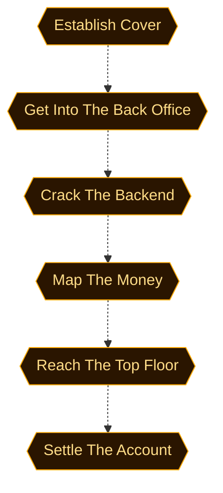
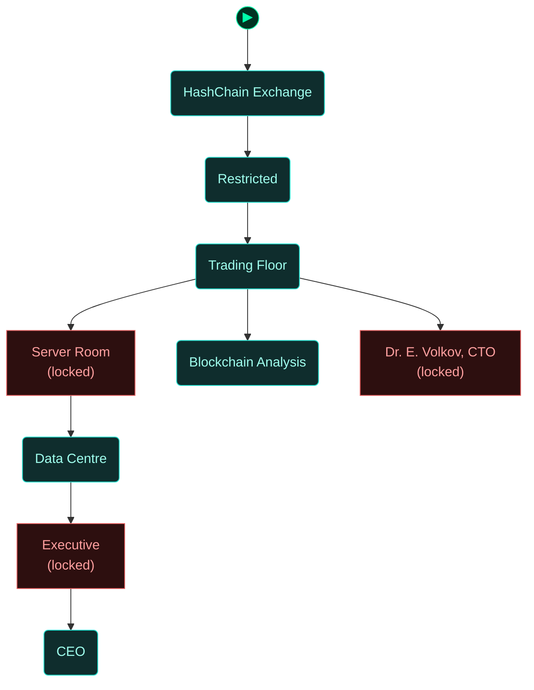

<!-- Auto-generated by scripts/generate_dungeon_graph.rb — do not edit by hand -->

# m06_follow_the_money — Scenario Graph Reference

Track cryptocurrency payments from previous ENTROPY operations to the Crypto Anarchists' HashChain Exchange. Infiltrate as a compliance auditor, map the financial network funding every ENTROPY cell, and find out what The Architect is buying with it.

## Scenario Statistics

| Metric | Value |
|---|---|
| Story aims | 6 |
| Total tasks | 23 (4 optional) |
| VM flag challenges | 4 |
| Physical locks | 11 |
| AND-gate convergences | 0 |
| Rooms | 9 |
| Puzzle graph nodes / edges | 47 / 50 |
| Story graph nodes / edges | 6 / 5 |

## Critical Path

5 hops through story aims — minimum mandatory sequence to reach mission completion:

**Establish Cover → Get Into The Back Office → Crack The Backend → Map The Money → Reach The Top Floor → Settle The Account**

## How to Read These Diagrams

| Shape | Colour | Meaning |
|---|---|---|
| Rounded rectangle | Teal | Room / physical area |
| Rectangle | Red | Lock, barrier, or interactive terminal |
| Diamond | Orange | Inventory item or credential |
| Diamond | Red/Pink | NPC or physical key |
| Diamond | Purple | VM flag (challenge completion token) |
| Rectangle | Blue | VM challenge |
| Ribbon | Amber | NPC conversation / action gate |
| Hexagon | Green | Story aim (objective) |
| Hexagon | Amber | Critical path node |
| Circle | Grey | AND gate (all inputs required) |
| Subroutine rect `[[…]]` | Green | Container (holds items) |
| Rounded rectangle | Amber | NPC in room (Rooms & Contents only) |

Edges: `-->` solid = hard dependency; `-.->` dashed = soft / narrative dependency or optional path.

The `▶` node marks the player's starting room.

## Puzzle Graph

Physical lock–key dependency chain. Shows which items, codes, and NPC interactions are required to open each lock, and which locks gate access to each room or object. Use this to trace solvability, spot circular dependencies, and check that every key is reachable before the lock that needs it.

```mermaid
flowchart TD

  classDef room      fill:#0f2d2d,stroke:#22ddcc,color:#a0ffee
  classDef lock      fill:#2d0f0f,stroke:#e66060,color:#ffa0a0
  classDef key       fill:#2d0812,stroke:#e66060,color:#ffa0a0
  classDef item      fill:#2d1200,stroke:#e89030,color:#ffcc80
  classDef gate      fill:#111,stroke:#666,color:#eee
  classDef vm        fill:#0c1f40,stroke:#4a90d9,color:#a0c8ff
  classDef flag      fill:#1a0c2d,stroke:#9060d0,color:#cc99ff
  classDef action    fill:#1a1200,stroke:#cc9922,color:#ffee88
  classDef aim       fill:#0d2a0d,stroke:#44cc44,color:#88ff88
  classDef aim_gate  fill:#111111,stroke:#44cc44,color:#44cc44
  classDef container fill:#1a2d1a,stroke:#60b060,color:#a0e0a0
  classDef npc       fill:#2d1f0d,stroke:#d0a050,color:#ffe0a0
  classDef critical  fill:#2a1500,stroke:#ffaa00,color:#ffdd88
  classDef start     fill:#003322,stroke:#00ffaa,color:#00ffaa

  node_start(("▶"))
  node_start --> reception_lobby

  door_server_room["Server Room<br/>Password lock"]
  server_room("Server Room")
  door_elena_office["Dr. E. Volkov, CTO<br/>RFID lock"]
  elena_office("Dr. E. Volkov, CTO")
  door_executive_wing["Executive<br/>RFID lock"]
  executive_wing("Executive")
  security_checkpoint("Restricted")
  it_new_starter_checklist{"IT New Starter Checklist"}
  trading_floor("Trading Floor")
  daily_trading_report{"Daily Trading Report"}
  rfid_badge_cloner{"RFID Badge Cloner"}
  npc_dr_elena_volkov{"Dr. Elena Volkov"}
  cto_access_badge{"CTO Access Badge"}
  password_dictionary_list{"Password Dictionary List"}
  lock_vm_launcher_hackme["Vm Launcher Hackme"]
  action_>""]
  hashchain_backend_server_terminal{"HashChain Backend Server Terminal"}
  lock_flag_station_financial["Flag Station Financial"]
  safetynet_financial_intelligence_drop{"SAFETYNET Financial Intelligence Drop"}
  rack_inventory_sheet{"Rack Inventory Sheet"}
  data_center("Data Centre")
  the_architect_s_fund_allocation{"The Architect's Fund Allocation"}
  lock_executive_access_badge["Executive Access Badge"]
  wallet_recovery_keys{"Wallet Recovery Keys"}
  executive_access_badge{"Executive Access Badge"}
  blockchain_lab("Blockchain Analysis")
  entropy_transaction_network_analysis{"ENTROPY Transaction Network Analysis"}
  lock_architects_fund_doc["Architects Fund Doc"]
  cryptography_research_notes{"Cryptography Research Notes"}
  email_from_the_architect{"Email: From The Architect"}
  lock_executive_safe["Executive Safe"]
  satoshi_office("CEO")
  crypto_anarchist_manifesto{"Crypto Anarchist Manifesto"}
  executive_safe{"Executive Safe"}
  npc_satoshi_nakamoto_ii{"Satoshi Nakamoto II"}
  vmch_submit_flag1["Crack the first server password and submit the flag"]
  vmfl_submit_flag1{"Flag1 Flag"}
  lock_credential_reuse_available["Credential Reuse Available"]
  vmch_submit_flag2["Reuse those credentials on the second server and submit the flag"]
  vmfl_submit_flag2{"Flag2 Flag"}
  lock_financial_database_reachable["Financial Database Reachable"]
  vmch_submit_flag3["Reach the financial database and submit the flag"]
  vmfl_submit_flag3{"Flag3 Flag"}
  lock_full_network_access["Full Network Access"]
  vmch_submit_flag4["Take the whole network and submit the final flag"]
  vmfl_submit_flag4{"Flag4 Flag"}
  reception_lobby("HashChain Exchange")

  door_server_room --> server_room
  door_elena_office --> elena_office
  door_executive_wing --> executive_wing
  security_checkpoint --> it_new_starter_checklist
  it_new_starter_checklist --> door_server_room
  trading_floor --> daily_trading_report
  trading_floor -.-> rfid_badge_cloner
  rfid_badge_cloner -.-> door_elena_office
  trading_floor --> npc_dr_elena_volkov
  npc_dr_elena_volkov --> cto_access_badge
  cto_access_badge --> door_elena_office
  npc_dr_elena_volkov --> password_dictionary_list
  password_dictionary_list --> lock_vm_launcher_hackme
  npc_dr_elena_volkov --> action_
  server_room --> hashchain_backend_server_terminal
  hashchain_backend_server_terminal --> lock_flag_station_financial
  server_room --> safetynet_financial_intelligence_drop
  server_room --> rack_inventory_sheet
  data_center --> the_architect_s_fund_allocation
  the_architect_s_fund_allocation --> lock_executive_access_badge
  data_center --> wallet_recovery_keys
  data_center --> executive_access_badge
  executive_access_badge --> door_executive_wing
  blockchain_lab --> entropy_transaction_network_analysis
  entropy_transaction_network_analysis --> lock_architects_fund_doc
  elena_office --> cryptography_research_notes
  elena_office --> email_from_the_architect
  email_from_the_architect --> lock_executive_safe
  satoshi_office -.-> crypto_anarchist_manifesto
  crypto_anarchist_manifesto -.-> lock_executive_safe
  satoshi_office --> lock_executive_safe
  satoshi_office -.-> executive_safe
  satoshi_office --> npc_satoshi_nakamoto_ii
  npc_satoshi_nakamoto_ii --> action_
  vmch_submit_flag1 --> vmfl_submit_flag1
  vmfl_submit_flag1 --> lock_credential_reuse_available
  vmch_submit_flag2 --> vmfl_submit_flag2
  vmfl_submit_flag1 -.-> vmch_submit_flag2
  vmfl_submit_flag2 --> lock_financial_database_reachable
  vmch_submit_flag3 --> vmfl_submit_flag3
  vmfl_submit_flag2 -.-> vmch_submit_flag3
  vmfl_submit_flag3 --> lock_full_network_access
  vmch_submit_flag4 --> vmfl_submit_flag4
  vmfl_submit_flag3 -.-> vmch_submit_flag4
  vmfl_submit_flag4 --> blockchain_lab
  lock_vm_launcher_hackme --> hashchain_backend_server_terminal
  hashchain_backend_server_terminal --> vmch_submit_flag1
  reception_lobby --> security_checkpoint
  security_checkpoint --> trading_floor
  trading_floor --> blockchain_lab

  class door_server_room,door_elena_office,door_executive_wing,lock_vm_launcher_hackme,lock_flag_station_financial,lock_executive_access_badge,lock_architects_fund_doc,lock_executive_safe,lock_credential_reuse_available,lock_financial_database_reachable,lock_full_network_access lock
  class server_room,elena_office,executive_wing,security_checkpoint,trading_floor,data_center,blockchain_lab,satoshi_office,reception_lobby room
  class it_new_starter_checklist,daily_trading_report,rfid_badge_cloner,password_dictionary_list,hashchain_backend_server_terminal,safetynet_financial_intelligence_drop,rack_inventory_sheet,the_architect_s_fund_allocation,wallet_recovery_keys,entropy_transaction_network_analysis,cryptography_research_notes,email_from_the_architect,crypto_anarchist_manifesto,executive_safe item
  class npc_dr_elena_volkov,cto_access_badge,executive_access_badge,npc_satoshi_nakamoto_ii key
  class action_ action
  class vmch_submit_flag1,vmch_submit_flag2,vmch_submit_flag3,vmch_submit_flag4 vm
  class vmfl_submit_flag1,vmfl_submit_flag2,vmfl_submit_flag3,vmfl_submit_flag4 flag

  classDef optional stroke-dasharray:5 2
  class rfid_badge_cloner,crypto_anarchist_manifesto,executive_safe optional
  class node_start start
```

## Story Aims

Narrative objective flow. Shows story aims and their unlock conditions. Critical path aims are highlighted in amber. Use this to check aim sequencing, identify gaps between objectives, and verify that the player always has a clear next goal.



## Story + Puzzle (Integrated)

Puzzle graph and story aims combined, with bridge edges connecting physical puzzle progress to story aim completion. Use this to verify that physical actions drive narrative progress and that no aim is left floating without a puzzle prerequisite.

```mermaid
flowchart TD

  classDef room      fill:#0f2d2d,stroke:#22ddcc,color:#a0ffee
  classDef lock      fill:#2d0f0f,stroke:#e66060,color:#ffa0a0
  classDef key       fill:#2d0812,stroke:#e66060,color:#ffa0a0
  classDef item      fill:#2d1200,stroke:#e89030,color:#ffcc80
  classDef gate      fill:#111,stroke:#666,color:#eee
  classDef vm        fill:#0c1f40,stroke:#4a90d9,color:#a0c8ff
  classDef flag      fill:#1a0c2d,stroke:#9060d0,color:#cc99ff
  classDef action    fill:#1a1200,stroke:#cc9922,color:#ffee88
  classDef aim       fill:#0d2a0d,stroke:#44cc44,color:#88ff88
  classDef aim_gate  fill:#111111,stroke:#44cc44,color:#44cc44
  classDef container fill:#1a2d1a,stroke:#60b060,color:#a0e0a0
  classDef npc       fill:#2d1f0d,stroke:#d0a050,color:#ffe0a0
  classDef critical  fill:#2a1500,stroke:#ffaa00,color:#ffdd88
  classDef start     fill:#003322,stroke:#00ffaa,color:#00ffaa

  node_start(("▶"))
  node_start --> reception_lobby

  door_server_room["Server Room<br/>Password lock"]
  server_room("Server Room")
  door_elena_office["Dr. E. Volkov, CTO<br/>RFID lock"]
  elena_office("Dr. E. Volkov, CTO")
  door_executive_wing["Executive<br/>RFID lock"]
  executive_wing("Executive")
  security_checkpoint("Restricted")
  it_new_starter_checklist{"IT New Starter Checklist"}
  trading_floor("Trading Floor")
  daily_trading_report{"Daily Trading Report"}
  rfid_badge_cloner{"RFID Badge Cloner"}
  npc_dr_elena_volkov{"Dr. Elena Volkov"}
  cto_access_badge{"CTO Access Badge"}
  password_dictionary_list{"Password Dictionary List"}
  lock_vm_launcher_hackme["Vm Launcher Hackme"]
  action_>""]
  hashchain_backend_server_terminal{"HashChain Backend Server Terminal"}
  lock_flag_station_financial["Flag Station Financial"]
  safetynet_financial_intelligence_drop{"SAFETYNET Financial Intelligence Drop"}
  rack_inventory_sheet{"Rack Inventory Sheet"}
  data_center("Data Centre")
  the_architect_s_fund_allocation{"The Architect's Fund Allocation"}
  lock_executive_access_badge["Executive Access Badge"]
  wallet_recovery_keys{"Wallet Recovery Keys"}
  executive_access_badge{"Executive Access Badge"}
  blockchain_lab("Blockchain Analysis")
  entropy_transaction_network_analysis{"ENTROPY Transaction Network Analysis"}
  lock_architects_fund_doc["Architects Fund Doc"]
  cryptography_research_notes{"Cryptography Research Notes"}
  email_from_the_architect{"Email: From The Architect"}
  lock_executive_safe["Executive Safe"]
  satoshi_office("CEO")
  crypto_anarchist_manifesto{"Crypto Anarchist Manifesto"}
  executive_safe{"Executive Safe"}
  npc_satoshi_nakamoto_ii{"Satoshi Nakamoto II"}
  vmch_submit_flag1["Crack the first server password and submit the flag"]
  vmfl_submit_flag1{"Flag1 Flag"}
  lock_credential_reuse_available["Credential Reuse Available"]
  vmch_submit_flag2["Reuse those credentials on the second server and submit the flag"]
  vmfl_submit_flag2{"Flag2 Flag"}
  lock_financial_database_reachable["Financial Database Reachable"]
  vmch_submit_flag3["Reach the financial database and submit the flag"]
  vmfl_submit_flag3{"Flag3 Flag"}
  lock_full_network_access["Full Network Access"]
  vmch_submit_flag4["Take the whole network and submit the final flag"]
  vmfl_submit_flag4{"Flag4 Flag"}
  reception_lobby("HashChain Exchange")
  aim_establish_cover{{"Establish Cover"}}
  aim_access_backend_systems{{"Get Into The Back Office"}}
  aim_crack_passwords{{"Crack The Backend"}}
  aim_map_financial_network{{"Map The Money"}}
  aim_breach_executive_wing{{"Reach The Top Floor"}}
  aim_resolve_the_fund{{"Settle The Account"}}

  door_server_room --> server_room
  door_elena_office --> elena_office
  door_executive_wing --> executive_wing
  security_checkpoint --> it_new_starter_checklist
  it_new_starter_checklist --> door_server_room
  trading_floor --> daily_trading_report
  trading_floor -.-> rfid_badge_cloner
  rfid_badge_cloner -.-> door_elena_office
  trading_floor --> npc_dr_elena_volkov
  npc_dr_elena_volkov --> cto_access_badge
  cto_access_badge --> door_elena_office
  npc_dr_elena_volkov --> password_dictionary_list
  password_dictionary_list --> lock_vm_launcher_hackme
  npc_dr_elena_volkov --> action_
  server_room --> hashchain_backend_server_terminal
  hashchain_backend_server_terminal --> lock_flag_station_financial
  server_room --> safetynet_financial_intelligence_drop
  server_room --> rack_inventory_sheet
  data_center --> the_architect_s_fund_allocation
  the_architect_s_fund_allocation --> lock_executive_access_badge
  data_center --> wallet_recovery_keys
  data_center --> executive_access_badge
  executive_access_badge --> door_executive_wing
  blockchain_lab --> entropy_transaction_network_analysis
  entropy_transaction_network_analysis --> lock_architects_fund_doc
  elena_office --> cryptography_research_notes
  elena_office --> email_from_the_architect
  email_from_the_architect --> lock_executive_safe
  satoshi_office -.-> crypto_anarchist_manifesto
  crypto_anarchist_manifesto -.-> lock_executive_safe
  satoshi_office --> lock_executive_safe
  satoshi_office -.-> executive_safe
  satoshi_office --> npc_satoshi_nakamoto_ii
  npc_satoshi_nakamoto_ii --> action_
  vmch_submit_flag1 --> vmfl_submit_flag1
  vmfl_submit_flag1 --> lock_credential_reuse_available
  vmch_submit_flag2 --> vmfl_submit_flag2
  vmfl_submit_flag1 -.-> vmch_submit_flag2
  vmfl_submit_flag2 --> lock_financial_database_reachable
  vmch_submit_flag3 --> vmfl_submit_flag3
  vmfl_submit_flag2 -.-> vmch_submit_flag3
  vmfl_submit_flag3 --> lock_full_network_access
  vmch_submit_flag4 --> vmfl_submit_flag4
  vmfl_submit_flag3 -.-> vmch_submit_flag4
  vmfl_submit_flag4 --> blockchain_lab
  lock_vm_launcher_hackme --> hashchain_backend_server_terminal
  hashchain_backend_server_terminal --> vmch_submit_flag1
  reception_lobby --> security_checkpoint
  security_checkpoint --> trading_floor
  trading_floor --> blockchain_lab
  aim_establish_cover -.-> aim_access_backend_systems
  aim_access_backend_systems -.-> aim_crack_passwords
  aim_crack_passwords -.-> aim_map_financial_network
  aim_map_financial_network -.-> aim_breach_executive_wing
  aim_breach_executive_wing -.-> aim_resolve_the_fund
  password_dictionary_list -.-> aim_access_backend_systems
  door_server_room -.-> aim_access_backend_systems
  server_room -.-> aim_crack_passwords
  lock_vm_launcher_hackme -.-> aim_crack_passwords
  vmfl_submit_flag1 -.-> aim_crack_passwords
  vmfl_submit_flag2 -.-> aim_crack_passwords
  vmfl_submit_flag3 -.-> aim_crack_passwords
  vmfl_submit_flag4 -.-> aim_crack_passwords
  vmfl_submit_flag4 -.-> aim_map_financial_network
  blockchain_lab -.-> aim_map_financial_network
  entropy_transaction_network_analysis -.-> aim_map_financial_network
  data_center -.-> aim_map_financial_network
  the_architect_s_fund_allocation -.-> aim_map_financial_network
  executive_access_badge -.-> aim_breach_executive_wing
  satoshi_office -.-> aim_breach_executive_wing
  satoshi_office -.-> aim_resolve_the_fund
  lock_executive_safe -.-> aim_breach_executive_wing

  class door_server_room,door_elena_office,door_executive_wing,lock_vm_launcher_hackme,lock_flag_station_financial,lock_executive_access_badge,lock_architects_fund_doc,lock_executive_safe,lock_credential_reuse_available,lock_financial_database_reachable,lock_full_network_access lock
  class server_room,elena_office,executive_wing,security_checkpoint,trading_floor,data_center,blockchain_lab,satoshi_office,reception_lobby room
  class it_new_starter_checklist,daily_trading_report,rfid_badge_cloner,password_dictionary_list,hashchain_backend_server_terminal,safetynet_financial_intelligence_drop,rack_inventory_sheet,the_architect_s_fund_allocation,wallet_recovery_keys,entropy_transaction_network_analysis,cryptography_research_notes,email_from_the_architect,crypto_anarchist_manifesto,executive_safe item
  class npc_dr_elena_volkov,cto_access_badge,executive_access_badge,npc_satoshi_nakamoto_ii key
  class action_ action
  class vmch_submit_flag1,vmch_submit_flag2,vmch_submit_flag3,vmch_submit_flag4 vm
  class vmfl_submit_flag1,vmfl_submit_flag2,vmfl_submit_flag3,vmfl_submit_flag4 flag
  class aim_establish_cover,aim_access_backend_systems,aim_crack_passwords,aim_map_financial_network,aim_breach_executive_wing,aim_resolve_the_fund critical

  classDef optional stroke-dasharray:5 2
  class rfid_badge_cloner,crypto_anarchist_manifesto,executive_safe optional
  class node_start start
```

## Rooms

Physical room layout with all connections. Locked rooms are shown in red. Use this to check room reachability, identify dead-end rooms with no content, and understand the spatial structure of the scenario.



## Rooms & Contents

Physical room layout with all objects, containers, NPCs, and held items. Use this to check clue distribution across rooms, verify that hints are placed before the locks they solve, and spot rooms that are under- or over-loaded with content.

```mermaid
flowchart TD

  classDef room      fill:#0f2d2d,stroke:#22ddcc,color:#a0ffee
  classDef lock      fill:#2d0f0f,stroke:#e66060,color:#ffa0a0
  classDef key       fill:#2d0812,stroke:#e66060,color:#ffa0a0
  classDef item      fill:#2d1200,stroke:#e89030,color:#ffcc80
  classDef gate      fill:#111,stroke:#666,color:#eee
  classDef vm        fill:#0c1f40,stroke:#4a90d9,color:#a0c8ff
  classDef flag      fill:#1a0c2d,stroke:#9060d0,color:#cc99ff
  classDef action    fill:#1a1200,stroke:#cc9922,color:#ffee88
  classDef aim       fill:#0d2a0d,stroke:#44cc44,color:#88ff88
  classDef aim_gate  fill:#111111,stroke:#44cc44,color:#44cc44
  classDef container fill:#1a2d1a,stroke:#60b060,color:#a0e0a0
  classDef npc       fill:#2d1f0d,stroke:#d0a050,color:#ffe0a0
  classDef critical  fill:#2a1500,stroke:#ffaa00,color:#ffdd88
  classDef start     fill:#003322,stroke:#00ffaa,color:#00ffaa

  node_start(("▶"))
  node_start --> reception_lobby

  reception_lobby("HashChain Exchange")
  security_checkpoint("Restricted")
  trading_floor("Trading Floor")
  server_room["Server Room<br/>(locked)"]
  data_center("Data Centre")
  blockchain_lab("Blockchain Analysis")
  elena_office["Dr. E. Volkov, CTO<br/>(locked)"]
  executive_wing["Executive<br/>(locked)"]
  satoshi_office("CEO")
  rc_hashchain_brochure_1{"HashChain Exchange Brochure"}
  rc_npc_agent_hax_2("Agent HaX")
  rc_npc_director_magnus_netherton_3("Director Magnus Netherton")
  rc_npc_agent_0x47_nightshade_4("Agent 0x47 'Nightshade'")
  rc_npc_agent_hax_5("Agent HaX")
  rc_obj6_6{"SAFETYNET Field Guide: SSH Access and Password Cracking"}
  rc_obj7_7{"SAFETYNET Field Guide: Privilege Escalation and Credential Reuse"}
  rc_obj8_8{"SAFETYNET Field Guide: Reconnaissance and Network Mapping"}
  rc_obj9_9{"SAFETYNET Field Guide: RFID Cloning"}
  rc_npc_agent_hax_10("Agent HaX")
  rc_it_onboarding_checklist_11{"IT New Starter Checklist"}
  rc_trading_workstation_12{"Trading Workstation"}
  rc_daily_trading_report_13{"Daily Trading Report"}
  rc_rfid_cloner_14{"RFID Badge Cloner"}
  rc_npc_dr_elena_volkov_15("Dr. Elena Volkov")
  rc_obj16_16{"CTO Access Badge"}
  rc_obj17_17{"Password Dictionary List"}
  rc_npc_dani_okonkwo_18("Dani Okonkwo")
  rc_vm_launcher_hackme_19{"HashChain Backend Server Terminal"}
  rc_flag_station_financial_20{"SAFETYNET Financial Intelligence Drop"}
  rc_server_rack_labels_21{"Rack Inventory Sheet"}
  rc_transaction_server_22[["Financial Transaction Server"]]
  rc_settlement_log_23{"settlement_exceptions.log"}
  rc_mixer_config_24{"mixer_pool_config.yml"}
  rc_cold_storage_index_25{"cold_storage_index.csv"}
  rc_architects_fund_doc_26{"The Architect's Fund Allocation"}
  rc_wallet_recovery_keys_27{"Wallet Recovery Keys"}
  rc_executive_access_badge_28{"Executive Access Badge"}
  rc_blockchain_workstation_29{"Blockchain Analysis Workstation"}
  rc_blockchain_evidence_30{"ENTROPY Transaction Network Analysis"}
  rc_mixing_analysis_31{"Privacy Coin Mixing Analysis"}
  rc_npc_priya_raghavan_32("Priya Raghavan")
  rc_elena_workstation_33{"Elena's Secure Workstation"}
  rc_elena_research_notes_34{"Cryptography Research Notes"}
  rc_architect_email_35{"Email: From The Architect"}
  rc_executive_wing_plaque_36{"Framed Press Clipping"}
  rc_crypto_anarchist_manifesto_37{"Crypto Anarchist Manifesto"}
  rc_executive_safe_38[["Executive Safe"]]
  rc_architect_identity_file_39{"The Architect's Identity File"}
  rc_npc_satoshi_nakamoto_ii_40("Satoshi Nakamoto II")

  reception_lobby --> security_checkpoint
  security_checkpoint --> trading_floor
  trading_floor --> server_room
  trading_floor --> blockchain_lab
  trading_floor --> elena_office
  server_room --> data_center
  data_center --> executive_wing
  executive_wing --> satoshi_office
  reception_lobby --> rc_hashchain_brochure_1
  reception_lobby --> rc_npc_agent_hax_2
  reception_lobby --> rc_npc_director_magnus_netherton_3
  reception_lobby --> rc_npc_agent_0x47_nightshade_4
  reception_lobby --> rc_npc_agent_hax_5
  rc_npc_agent_hax_5 --> rc_obj6_6
  rc_npc_agent_hax_5 --> rc_obj7_7
  rc_npc_agent_hax_5 --> rc_obj8_8
  rc_npc_agent_hax_5 --> rc_obj9_9
  reception_lobby --> rc_npc_agent_hax_10
  security_checkpoint --> rc_it_onboarding_checklist_11
  trading_floor --> rc_trading_workstation_12
  trading_floor --> rc_daily_trading_report_13
  trading_floor --> rc_rfid_cloner_14
  trading_floor --> rc_npc_dr_elena_volkov_15
  rc_npc_dr_elena_volkov_15 --> rc_obj16_16
  rc_npc_dr_elena_volkov_15 --> rc_obj17_17
  trading_floor --> rc_npc_dani_okonkwo_18
  server_room --> rc_vm_launcher_hackme_19
  server_room --> rc_flag_station_financial_20
  server_room --> rc_server_rack_labels_21
  data_center --> rc_transaction_server_22
  rc_transaction_server_22 --> rc_settlement_log_23
  rc_transaction_server_22 --> rc_mixer_config_24
  rc_transaction_server_22 --> rc_cold_storage_index_25
  data_center --> rc_architects_fund_doc_26
  data_center --> rc_wallet_recovery_keys_27
  data_center --> rc_executive_access_badge_28
  blockchain_lab --> rc_blockchain_workstation_29
  blockchain_lab --> rc_blockchain_evidence_30
  blockchain_lab --> rc_mixing_analysis_31
  blockchain_lab --> rc_npc_priya_raghavan_32
  elena_office --> rc_elena_workstation_33
  elena_office --> rc_elena_research_notes_34
  elena_office --> rc_architect_email_35
  executive_wing --> rc_executive_wing_plaque_36
  satoshi_office --> rc_crypto_anarchist_manifesto_37
  satoshi_office --> rc_executive_safe_38
  rc_executive_safe_38 --> rc_architect_identity_file_39
  satoshi_office --> rc_npc_satoshi_nakamoto_ii_40

  class reception_lobby,security_checkpoint,trading_floor,data_center,blockchain_lab,satoshi_office room
  class server_room,elena_office,executive_wing lock
  class rc_hashchain_brochure_1,rc_obj6_6,rc_obj7_7,rc_obj8_8,rc_obj9_9,rc_it_onboarding_checklist_11,rc_trading_workstation_12,rc_daily_trading_report_13,rc_rfid_cloner_14,rc_obj16_16,rc_obj17_17,rc_vm_launcher_hackme_19,rc_flag_station_financial_20,rc_server_rack_labels_21,rc_settlement_log_23,rc_mixer_config_24,rc_cold_storage_index_25,rc_architects_fund_doc_26,rc_wallet_recovery_keys_27,rc_executive_access_badge_28,rc_blockchain_workstation_29,rc_blockchain_evidence_30,rc_mixing_analysis_31,rc_elena_workstation_33,rc_elena_research_notes_34,rc_architect_email_35,rc_executive_wing_plaque_36,rc_crypto_anarchist_manifesto_37,rc_architect_identity_file_39 item
  class rc_npc_agent_hax_2,rc_npc_director_magnus_netherton_3,rc_npc_agent_0x47_nightshade_4,rc_npc_agent_hax_5,rc_npc_agent_hax_10,rc_npc_dr_elena_volkov_15,rc_npc_dani_okonkwo_18,rc_npc_priya_raghavan_32,rc_npc_satoshi_nakamoto_ii_40 npc
  class rc_transaction_server_22,rc_executive_safe_38 container
  class node_start start
```


