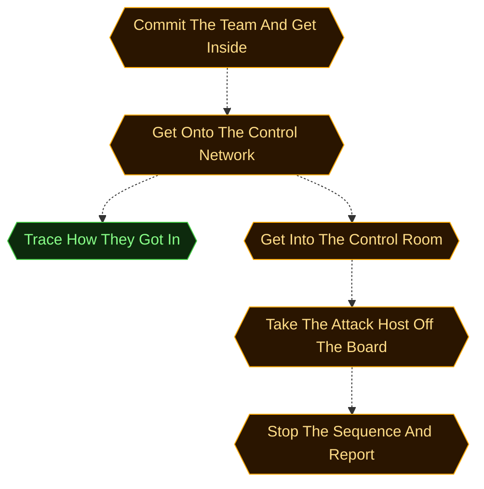
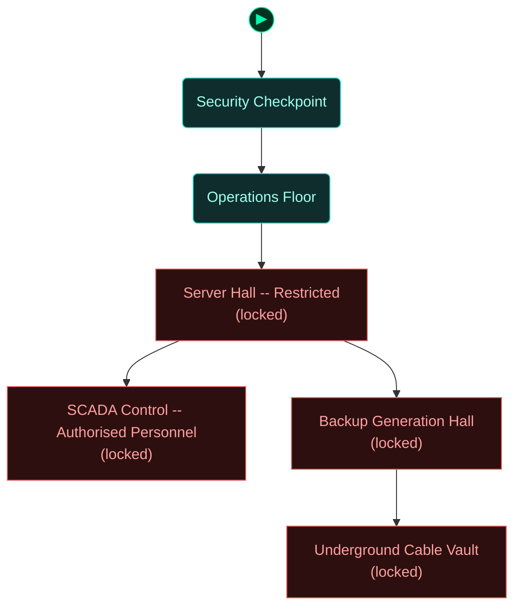

<!-- Auto-generated by scripts/generate_dungeon_graph.rb — do not edit by hand -->

# m07_architects_gambit — Scenario Graph Reference

Four ENTROPY operations went live inside the same sixty seconds. SAFETYNET has one agent in range and one tactical team. You are the agent, and you are already on the approach road to a regional grid control facility outside Portland where a cascade script on a local timer is thirty minutes from taking the lights out across three states -- 8.4 million people, 147 substations, in winter. The team can reach exactly one of the other three crises. You decide which. Two go unanswered, and somebody will read out what happened at both.

## Scenario Statistics

| Metric | Value |
|---|---|
| Story aims | 6 |
| Total tasks | 18 (5 optional) |
| VM flag challenges | 4 |
| Physical locks | 6 |
| AND-gate convergences | 0 |
| Rooms | 6 |
| Puzzle graph nodes / edges | 34 / 36 |
| Story graph nodes / edges | 6 / 5 |

## Critical Path

4 hops through story aims — minimum mandatory sequence to reach mission completion:

**Commit The Team And Get Inside → Get Onto The Control Network → Get Into The Control Room → Take The Attack Host Off The Board → Stop The Sequence And Report**

## How to Read These Diagrams

| Shape | Colour | Meaning |
|---|---|---|
| Rounded rectangle | Teal | Room / physical area |
| Rectangle | Red | Lock, barrier, or interactive terminal |
| Diamond | Orange | Inventory item or credential |
| Diamond | Red/Pink | NPC or physical key |
| Diamond | Purple | VM flag (challenge completion token) |
| Rectangle | Blue | VM challenge |
| Ribbon | Amber | NPC conversation / action gate |
| Hexagon | Green | Story aim (objective) |
| Hexagon | Amber | Critical path node |
| Circle | Grey | AND gate (all inputs required) |
| Subroutine rect `[[…]]` | Green | Container (holds items) |
| Rounded rectangle | Amber | NPC in room (Rooms & Contents only) |

Edges: `-->` solid = hard dependency; `-.->` dashed = soft / narrative dependency or optional path.

The `▶` node marks the player's starting room.

## Puzzle Graph

Physical lock–key dependency chain. Shows which items, codes, and NPC interactions are required to open each lock, and which locks gate access to each room or object. Use this to trace solvability, spot circular dependencies, and check that every key is reachable before the lock that needs it.

```mermaid
flowchart TD

  classDef room      fill:#0f2d2d,stroke:#22ddcc,color:#a0ffee
  classDef lock      fill:#2d0f0f,stroke:#e66060,color:#ffa0a0
  classDef key       fill:#2d0812,stroke:#e66060,color:#ffa0a0
  classDef item      fill:#2d1200,stroke:#e89030,color:#ffcc80
  classDef gate      fill:#111,stroke:#666,color:#eee
  classDef vm        fill:#0c1f40,stroke:#4a90d9,color:#a0c8ff
  classDef flag      fill:#1a0c2d,stroke:#9060d0,color:#cc99ff
  classDef action    fill:#1a1200,stroke:#cc9922,color:#ffee88
  classDef aim       fill:#0d2a0d,stroke:#44cc44,color:#88ff88
  classDef aim_gate  fill:#111111,stroke:#44cc44,color:#44cc44
  classDef container fill:#1a2d1a,stroke:#60b060,color:#a0e0a0
  classDef npc       fill:#2d1f0d,stroke:#d0a050,color:#ffe0a0
  classDef critical  fill:#2a1500,stroke:#ffaa00,color:#ffdd88
  classDef start     fill:#003322,stroke:#00ffaa,color:#00ffaa

  node_start(("▶"))
  node_start --> security_checkpoint

  door_server_room["Server Hall -- Restricted<br/>RFID lock"]
  server_room("Server Hall -- Restricted")
  door_scada_control["SCADA Control -- Authorised Personnel<br/>Password lock"]
  scada_control("SCADA Control -- Authorised Personnel")
  door_generator_room["Backup Generation Hall<br/>Key lock"]
  generator_room("Backup Generation Hall")
  door_cable_vault["Underground Cable Vault<br/>PIN lock"]
  cable_vault("Underground Cable Vault")
  security_checkpoint("Security Checkpoint")
  lock_pick_kit{"Lock Pick Kit"}
  visitor_badge_printer{"Visitor Badge Printer"}
  audited_visitor_log{"Audited Visitor Log"}
  npc_jake_morrison{"Jake Morrison"}
  facility_access_badge_server_zone{"Facility Access Badge -- Server Zone"}
  operations_floor("Operations Floor")
  plant_maintenance_key{"Plant Maintenance Key"}
  vm_access_terminal["VM Access Terminal"]
  safetynet_relay_terminal{"SAFETYNET Relay Terminal"}
  npc_elena_rodriguez{"Elena Rodriguez"}
  action_question_elena>"Get the SCADA control room password from Elena"]
  lock_crisis_control_system["Cascade Control System<br/>Flag lock"]
  cascade_control_system["Cascade Control System"]
  signed_casualty_projection{"Signed Casualty Projection"}
  plant_maintenance_log{"Plant Maintenance Log"}
  recovered_site_reference_tomb_gamma{"Recovered Site Reference -- 'Tomb Gamma'"}
  intercepted_mail_deployment_confirmed{"Intercepted Mail -- Deployment Confirmed"}
  vmch_recover_coordination_traffic["Mount the exposed NFS export and submit what is on it"]
  vmfl_recover_coordination_traffic{"Recover Coordination Traffic Flag"}
  vmch_intercept_c2_channel["Enumerate the host's services and submit the command channel flag"]
  vmfl_intercept_c2_channel{"Intercept C2 Channel Flag"}
  vmch_escalate_on_attack_host["Escalate to root on the attack host and submit the flag"]
  vmfl_escalate_on_attack_host{"Escalate On Attack Host Flag"}
  vmch_terminate_cascade_scripts["Kill the running attack processes and lock out remote access"]
  vmfl_terminate_cascade_scripts{"Terminate Cascade Scripts Flag"}

  door_server_room --> server_room
  door_scada_control --> scada_control
  door_generator_room --> generator_room
  door_cable_vault --> cable_vault
  security_checkpoint -.-> lock_pick_kit
  lock_pick_kit -.-> door_generator_room
  security_checkpoint -.-> visitor_badge_printer
  visitor_badge_printer -.-> door_server_room
  security_checkpoint --> audited_visitor_log
  security_checkpoint --> npc_jake_morrison
  npc_jake_morrison --> facility_access_badge_server_zone
  facility_access_badge_server_zone --> door_server_room
  operations_floor --> plant_maintenance_key
  plant_maintenance_key --> door_generator_room
  server_room --> vm_access_terminal
  server_room --> safetynet_relay_terminal
  safetynet_relay_terminal --> door_scada_control
  server_room --> npc_elena_rodriguez
  npc_elena_rodriguez --> action_question_elena
  scada_control --> lock_crisis_control_system
  scada_control --> cascade_control_system
  scada_control --> signed_casualty_projection
  generator_room --> plant_maintenance_log
  plant_maintenance_log --> door_cable_vault
  cable_vault --> recovered_site_reference_tomb_gamma
  cable_vault --> intercepted_mail_deployment_confirmed
  vmch_recover_coordination_traffic --> vmfl_recover_coordination_traffic
  vmch_intercept_c2_channel --> vmfl_intercept_c2_channel
  vmfl_recover_coordination_traffic -.-> vmch_intercept_c2_channel
  vmfl_intercept_c2_channel --> door_scada_control
  vmch_escalate_on_attack_host --> vmfl_escalate_on_attack_host
  vmfl_intercept_c2_channel -.-> vmch_escalate_on_attack_host
  vmch_terminate_cascade_scripts --> vmfl_terminate_cascade_scripts
  vmfl_escalate_on_attack_host -.-> vmch_terminate_cascade_scripts
  vm_access_terminal --> vmch_recover_coordination_traffic
  security_checkpoint --> operations_floor

  class door_server_room,door_scada_control,door_generator_room,door_cable_vault,lock_crisis_control_system,cascade_control_system lock
  class server_room,scada_control,generator_room,cable_vault,security_checkpoint,operations_floor room
  class lock_pick_kit,audited_visitor_log,safetynet_relay_terminal,signed_casualty_projection,recovered_site_reference_tomb_gamma,intercepted_mail_deployment_confirmed item
  class visitor_badge_printer,npc_jake_morrison,facility_access_badge_server_zone,plant_maintenance_key,npc_elena_rodriguez,plant_maintenance_log key
  class vm_access_terminal,vmch_recover_coordination_traffic,vmch_intercept_c2_channel,vmch_escalate_on_attack_host,vmch_terminate_cascade_scripts vm
  class action_question_elena action
  class vmfl_recover_coordination_traffic,vmfl_intercept_c2_channel,vmfl_escalate_on_attack_host,vmfl_terminate_cascade_scripts flag

  classDef optional stroke-dasharray:5 2
  class lock_pick_kit,visitor_badge_printer optional
  class node_start start
```

## Story Aims

Narrative objective flow. Shows story aims and their unlock conditions. Critical path aims are highlighted in amber. Use this to check aim sequencing, identify gaps between objectives, and verify that the player always has a clear next goal.

## Story + Puzzle (Integrated)

Puzzle graph and story aims combined, with bridge edges connecting physical puzzle progress to story aim completion. Use this to verify that physical actions drive narrative progress and that no aim is left floating without a puzzle prerequisite.

```mermaid
flowchart TD

  classDef room      fill:#0f2d2d,stroke:#22ddcc,color:#a0ffee
  classDef lock      fill:#2d0f0f,stroke:#e66060,color:#ffa0a0
  classDef key       fill:#2d0812,stroke:#e66060,color:#ffa0a0
  classDef item      fill:#2d1200,stroke:#e89030,color:#ffcc80
  classDef gate      fill:#111,stroke:#666,color:#eee
  classDef vm        fill:#0c1f40,stroke:#4a90d9,color:#a0c8ff
  classDef flag      fill:#1a0c2d,stroke:#9060d0,color:#cc99ff
  classDef action    fill:#1a1200,stroke:#cc9922,color:#ffee88
  classDef aim       fill:#0d2a0d,stroke:#44cc44,color:#88ff88
  classDef aim_gate  fill:#111111,stroke:#44cc44,color:#44cc44
  classDef container fill:#1a2d1a,stroke:#60b060,color:#a0e0a0
  classDef npc       fill:#2d1f0d,stroke:#d0a050,color:#ffe0a0
  classDef critical  fill:#2a1500,stroke:#ffaa00,color:#ffdd88
  classDef start     fill:#003322,stroke:#00ffaa,color:#00ffaa

  node_start(("▶"))
  node_start --> security_checkpoint

  door_server_room["Server Hall -- Restricted<br/>RFID lock"]
  server_room("Server Hall -- Restricted")
  door_scada_control["SCADA Control -- Authorised Personnel<br/>Password lock"]
  scada_control("SCADA Control -- Authorised Personnel")
  door_generator_room["Backup Generation Hall<br/>Key lock"]
  generator_room("Backup Generation Hall")
  door_cable_vault["Underground Cable Vault<br/>PIN lock"]
  cable_vault("Underground Cable Vault")
  security_checkpoint("Security Checkpoint")
  lock_pick_kit{"Lock Pick Kit"}
  visitor_badge_printer{"Visitor Badge Printer"}
  audited_visitor_log{"Audited Visitor Log"}
  npc_jake_morrison{"Jake Morrison"}
  facility_access_badge_server_zone{"Facility Access Badge -- Server Zone"}
  operations_floor("Operations Floor")
  plant_maintenance_key{"Plant Maintenance Key"}
  vm_access_terminal["VM Access Terminal"]
  safetynet_relay_terminal{"SAFETYNET Relay Terminal"}
  npc_elena_rodriguez{"Elena Rodriguez"}
  action_question_elena>"Get the SCADA control room password from Elena"]
  lock_crisis_control_system["Cascade Control System<br/>Flag lock"]
  cascade_control_system["Cascade Control System"]
  signed_casualty_projection{"Signed Casualty Projection"}
  plant_maintenance_log{"Plant Maintenance Log"}
  recovered_site_reference_tomb_gamma{"Recovered Site Reference -- 'Tomb Gamma'"}
  intercepted_mail_deployment_confirmed{"Intercepted Mail -- Deployment Confirmed"}
  vmch_recover_coordination_traffic["Mount the exposed NFS export and submit what is on it"]
  vmfl_recover_coordination_traffic{"Recover Coordination Traffic Flag"}
  vmch_intercept_c2_channel["Enumerate the host's services and submit the command channel flag"]
  vmfl_intercept_c2_channel{"Intercept C2 Channel Flag"}
  vmch_escalate_on_attack_host["Escalate to root on the attack host and submit the flag"]
  vmfl_escalate_on_attack_host{"Escalate On Attack Host Flag"}
  vmch_terminate_cascade_scripts["Kill the running attack processes and lock out remote access"]
  vmfl_terminate_cascade_scripts{"Terminate Cascade Scripts Flag"}
  aim_commit_the_team{{"Commit The Team And Get Inside"}}
  aim_reach_the_control_network{{"Get Onto The Control Network"}}
  aim_trace_the_intrusion{{"Trace How They Got In"}}
  aim_reach_the_control_room{{"Get Into The Control Room"}}
  aim_take_the_attack_host{{"Take The Attack Host Off The Board"}}
  aim_end_the_sequence{{"Stop The Sequence And Report"}}

  door_server_room --> server_room
  door_scada_control --> scada_control
  door_generator_room --> generator_room
  door_cable_vault --> cable_vault
  security_checkpoint -.-> lock_pick_kit
  lock_pick_kit -.-> door_generator_room
  security_checkpoint -.-> visitor_badge_printer
  visitor_badge_printer -.-> door_server_room
  security_checkpoint --> audited_visitor_log
  security_checkpoint --> npc_jake_morrison
  npc_jake_morrison --> facility_access_badge_server_zone
  facility_access_badge_server_zone --> door_server_room
  operations_floor --> plant_maintenance_key
  plant_maintenance_key --> door_generator_room
  server_room --> vm_access_terminal
  server_room --> safetynet_relay_terminal
  safetynet_relay_terminal --> door_scada_control
  server_room --> npc_elena_rodriguez
  npc_elena_rodriguez --> action_question_elena
  scada_control --> lock_crisis_control_system
  scada_control --> cascade_control_system
  scada_control --> signed_casualty_projection
  generator_room --> plant_maintenance_log
  plant_maintenance_log --> door_cable_vault
  cable_vault --> recovered_site_reference_tomb_gamma
  cable_vault --> intercepted_mail_deployment_confirmed
  vmch_recover_coordination_traffic --> vmfl_recover_coordination_traffic
  vmch_intercept_c2_channel --> vmfl_intercept_c2_channel
  vmfl_recover_coordination_traffic -.-> vmch_intercept_c2_channel
  vmfl_intercept_c2_channel --> door_scada_control
  vmch_escalate_on_attack_host --> vmfl_escalate_on_attack_host
  vmfl_intercept_c2_channel -.-> vmch_escalate_on_attack_host
  vmch_terminate_cascade_scripts --> vmfl_terminate_cascade_scripts
  vmfl_escalate_on_attack_host -.-> vmch_terminate_cascade_scripts
  vm_access_terminal --> vmch_recover_coordination_traffic
  security_checkpoint --> operations_floor
  aim_commit_the_team -.-> aim_reach_the_control_network
  aim_reach_the_control_network -.-> aim_trace_the_intrusion
  aim_reach_the_control_network -.-> aim_reach_the_control_room
  aim_reach_the_control_room -.-> aim_take_the_attack_host
  aim_take_the_attack_host -.-> aim_end_the_sequence
  operations_floor -.-> aim_commit_the_team
  door_server_room -.-> aim_reach_the_control_network
  vmfl_recover_coordination_traffic -.-> aim_reach_the_control_network
  vmfl_intercept_c2_channel -.-> aim_reach_the_control_network
  door_generator_room -.-> aim_trace_the_intrusion
  door_cable_vault -.-> aim_trace_the_intrusion
  door_scada_control -.-> aim_reach_the_control_room
  vmfl_escalate_on_attack_host -.-> aim_take_the_attack_host
  vmfl_terminate_cascade_scripts -.-> aim_take_the_attack_host
  lock_crisis_control_system -.-> aim_end_the_sequence
  action_question_elena -.-> aim_reach_the_control_room

  class door_server_room,door_scada_control,door_generator_room,door_cable_vault,lock_crisis_control_system,cascade_control_system lock
  class server_room,scada_control,generator_room,cable_vault,security_checkpoint,operations_floor room
  class lock_pick_kit,audited_visitor_log,safetynet_relay_terminal,signed_casualty_projection,recovered_site_reference_tomb_gamma,intercepted_mail_deployment_confirmed item
  class visitor_badge_printer,npc_jake_morrison,facility_access_badge_server_zone,plant_maintenance_key,npc_elena_rodriguez,plant_maintenance_log key
  class vm_access_terminal,vmch_recover_coordination_traffic,vmch_intercept_c2_channel,vmch_escalate_on_attack_host,vmch_terminate_cascade_scripts vm
  class action_question_elena action
  class vmfl_recover_coordination_traffic,vmfl_intercept_c2_channel,vmfl_escalate_on_attack_host,vmfl_terminate_cascade_scripts flag
  class aim_commit_the_team,aim_reach_the_control_network,aim_reach_the_control_room,aim_take_the_attack_host,aim_end_the_sequence critical
  class aim_trace_the_intrusion aim

  classDef optional stroke-dasharray:5 2
  class lock_pick_kit,visitor_badge_printer optional
  class node_start start
```

## Rooms

Physical room layout with all connections. Locked rooms are shown in red. Use this to check room reachability, identify dead-end rooms with no content, and understand the spatial structure of the scenario.

## Rooms & Contents

Physical room layout with all objects, containers, NPCs, and held items. Use this to check clue distribution across rooms, verify that hints are placed before the locks they solve, and spot rooms that are under- or over-loaded with content.

```mermaid
flowchart TD

  classDef room      fill:#0f2d2d,stroke:#22ddcc,color:#a0ffee
  classDef lock      fill:#2d0f0f,stroke:#e66060,color:#ffa0a0
  classDef key       fill:#2d0812,stroke:#e66060,color:#ffa0a0
  classDef item      fill:#2d1200,stroke:#e89030,color:#ffcc80
  classDef gate      fill:#111,stroke:#666,color:#eee
  classDef vm        fill:#0c1f40,stroke:#4a90d9,color:#a0c8ff
  classDef flag      fill:#1a0c2d,stroke:#9060d0,color:#cc99ff
  classDef action    fill:#1a1200,stroke:#cc9922,color:#ffee88
  classDef aim       fill:#0d2a0d,stroke:#44cc44,color:#88ff88
  classDef aim_gate  fill:#111111,stroke:#44cc44,color:#44cc44
  classDef container fill:#1a2d1a,stroke:#60b060,color:#a0e0a0
  classDef npc       fill:#2d1f0d,stroke:#d0a050,color:#ffe0a0
  classDef critical  fill:#2a1500,stroke:#ffaa00,color:#ffdd88
  classDef start     fill:#003322,stroke:#00ffaa,color:#00ffaa

  node_start(("▶"))
  node_start --> security_checkpoint

  security_checkpoint("Security Checkpoint")
  operations_floor("Operations Floor")
  server_room["Server Hall -- Restricted<br/>(locked)"]
  scada_control["SCADA Control -- Authorised Personnel<br/>(locked)"]
  generator_room["Backup Generation Hall<br/>(locked)"]
  cable_vault["Underground Cable Vault<br/>(locked)"]
  rc_badge_printer_1{"Visitor Badge Printer"}
  rc_visitor_log_2{"Audited Visitor Log"}
  rc_checkpoint_evacuation_board_3{"Evacuation Status Board"}
  rc_npc_director_magnus_netherton_4("Director Magnus Netherton")
  rc_npc_agent_hax_5("Agent HaX")
  rc_obj6_6{"SAFETYNET Field Guide: RFID Cloning"}
  rc_obj7_7{"SAFETYNET Field Guide: Lockpicking"}
  rc_obj8_8{"SAFETYNET Field Guide: Reconnaissance and Network Mapping"}
  rc_obj9_9{"SAFETYNET Field Guide: Scanning and Exploitation"}
  rc_obj10_10{"SAFETYNET Field Guide: Privilege Escalation"}
  rc_npc_jake_morrison_11("Jake Morrison")
  rc_obj12_12{"Facility Access Badge -- Server Zone"}
  rc_generator_maintenance_key_13{"Plant Maintenance Key"}
  rc_situation_board_14{"Grid Situation Board"}
  rc_substation_map_15{"147-Substation Wall Map"}
  rc_ops_floor_workstation_16{"Abandoned Operator Workstation"}
  rc_vm_launcher_attack_terminal_17{"VM Access Terminal"}
  rc_flag_station_safetynet_relay_18{"SAFETYNET Relay Terminal"}
  rc_scada_backup_server_19{"SCADA Backup Server"}
  rc_rack_cabling_note_20{"Cabling Survey Note"}
  rc_npc_elena_rodriguez_21("Elena Rodriguez")
  rc_crisis_control_system_22[["Cascade Control System"]]
  rc_obj23_23{"Sequence Abort Confirmation"}
  rc_cascade_countdown_display_24{"Cascade Countdown Display"}
  rc_casualty_projection_25{"Signed Casualty Projection"}
  rc_npc_dr_james_mercer_26("Dr. James Mercer")
  rc_npc_director_magnus_netherton_27("Director Magnus Netherton")
  rc_npc_the_architect_28("The Architect")
  rc_maintenance_log_29{"Plant Maintenance Log"}
  rc_backup_transfer_switch_30{"Backup Power Transfer Switch"}
  rc_genset_control_panel_31{"Genset Control Panel"}
  rc_vault_trunk_runs_32{"Trunk Cable Runs"}
  rc_tomb_gamma_dossier_33{"Recovered Site Reference -- 'Tomb Gamma'"}
  rc_mole_intercept_evidence_34{"Intercepted Mail -- Deployment Confirmed"}
  rc_npc_thomas_park_35("Thomas Park")

  security_checkpoint --> operations_floor
  operations_floor --> server_room
  server_room --> scada_control
  server_room --> generator_room
  generator_room --> cable_vault
  security_checkpoint --> rc_badge_printer_1
  security_checkpoint --> rc_visitor_log_2
  security_checkpoint --> rc_checkpoint_evacuation_board_3
  security_checkpoint --> rc_npc_director_magnus_netherton_4
  security_checkpoint --> rc_npc_agent_hax_5
  rc_npc_agent_hax_5 --> rc_obj6_6
  rc_npc_agent_hax_5 --> rc_obj7_7
  rc_npc_agent_hax_5 --> rc_obj8_8
  rc_npc_agent_hax_5 --> rc_obj9_9
  rc_npc_agent_hax_5 --> rc_obj10_10
  security_checkpoint --> rc_npc_jake_morrison_11
  rc_npc_jake_morrison_11 --> rc_obj12_12
  operations_floor --> rc_generator_maintenance_key_13
  operations_floor --> rc_situation_board_14
  operations_floor --> rc_substation_map_15
  operations_floor --> rc_ops_floor_workstation_16
  server_room --> rc_vm_launcher_attack_terminal_17
  server_room --> rc_flag_station_safetynet_relay_18
  server_room --> rc_scada_backup_server_19
  server_room --> rc_rack_cabling_note_20
  server_room --> rc_npc_elena_rodriguez_21
  scada_control --> rc_crisis_control_system_22
  rc_crisis_control_system_22 --> rc_obj23_23
  scada_control --> rc_cascade_countdown_display_24
  scada_control --> rc_casualty_projection_25
  scada_control --> rc_npc_dr_james_mercer_26
  scada_control --> rc_npc_director_magnus_netherton_27
  scada_control --> rc_npc_the_architect_28
  generator_room --> rc_maintenance_log_29
  generator_room --> rc_backup_transfer_switch_30
  generator_room --> rc_genset_control_panel_31
  cable_vault --> rc_vault_trunk_runs_32
  cable_vault --> rc_tomb_gamma_dossier_33
  cable_vault --> rc_mole_intercept_evidence_34
  cable_vault --> rc_npc_thomas_park_35

  class security_checkpoint,operations_floor room
  class server_room,scada_control,generator_room,cable_vault lock
  class rc_badge_printer_1,rc_visitor_log_2,rc_checkpoint_evacuation_board_3,rc_obj6_6,rc_obj7_7,rc_obj8_8,rc_obj9_9,rc_obj10_10,rc_obj12_12,rc_generator_maintenance_key_13,rc_situation_board_14,rc_substation_map_15,rc_ops_floor_workstation_16,rc_vm_launcher_attack_terminal_17,rc_flag_station_safetynet_relay_18,rc_scada_backup_server_19,rc_rack_cabling_note_20,rc_obj23_23,rc_cascade_countdown_display_24,rc_casualty_projection_25,rc_maintenance_log_29,rc_backup_transfer_switch_30,rc_genset_control_panel_31,rc_vault_trunk_runs_32,rc_tomb_gamma_dossier_33,rc_mole_intercept_evidence_34 item
  class rc_npc_director_magnus_netherton_4,rc_npc_agent_hax_5,rc_npc_jake_morrison_11,rc_npc_elena_rodriguez_21,rc_npc_dr_james_mercer_26,rc_npc_director_magnus_netherton_27,rc_npc_the_architect_28,rc_npc_thomas_park_35 npc
  class rc_crisis_control_system_22 container
  class node_start start
```

