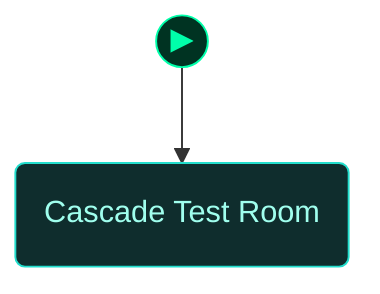
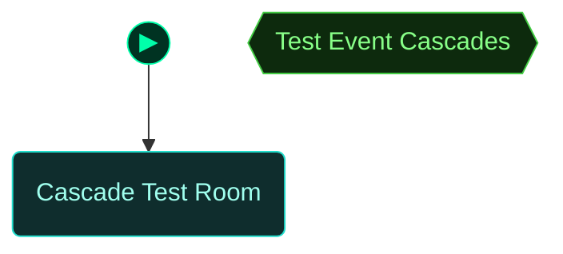
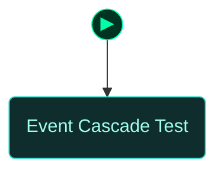
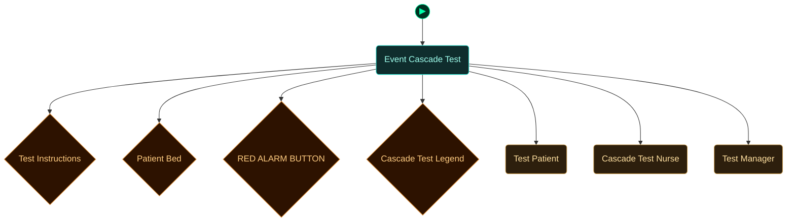

<!-- Auto-generated by scripts/generate_dungeon_graph.rb — do not edit by hand -->

# test_event_cascade — Scenario Graph Reference

EVENT CASCADE TEST (Phase 1-2)

This scenario tests event-driven NPC state transitions and multi-NPC reactions to global variable changes.

TEST PROCEDURE:

PART 1 - Single Event Trigger:
1. Game starts with three NPCs: Patient (bed), Nurse (patrol), Manager (office)
2. Interact with PATIENT BED
3. This sets 'patient_alert' = true
4. OBSERVE:
   • Patient NPC plays "alert" dialogue
   • Nurse STOPS patrol and walks to patient bed
   • Manager receives alert message in console log

PART 2 - Secondary Cascade:
5. Interact with ALARM BUTTON
6. This sets 'major_incident' = true
7. OBSERVE:
   • All NPCs get updated dialogue
   • Nurse SPEEDS UP (setPatrolSpeed: 150)
   • Nurse REDUCES dwelling time (setDwellMultiplier: 0.3)
   • Patient state changes to 'critical'
   • Color-coded narrative message appears

EXPECTED BEHAVIOR:
- Global variable changes broadcast to all listening NPCs
- Each NPC reacts according to eventMappings
- Multiple actions execute in sequence (setGlobal → state change → dialogue)
- Condition guards prevent duplicate reactions
- onceOnly flag prevents repeated firing

TEST DURATION: 2-3 minutes

KEY VALIDATION:
✓ Initial event triggers single NPC response
✓ Nurse patrol override works (goToAndStay)
✓ Secondary event triggers multi-NPC cascade
✓ Speed/dwell overrides take effect immediately
✓ All NPCs receive and react to broadcasts
✓ Conditions prevent unwanted triggers

## Scenario Statistics

| Metric | Value |
|---|---|
| Story aims | 1 |
| Total tasks | 5 (0 optional) |
| VM flag challenges | 0 |
| Physical locks | 0 |
| AND-gate convergences | 0 |
| Rooms | 0 |
| Puzzle graph nodes / edges | 0 / 0 |
| Story graph nodes / edges | 1 / 0 |

## Critical Path

0 hops through story aims — minimum mandatory sequence to reach mission completion:

****

## How to Read These Diagrams

| Shape | Colour | Meaning |
|---|---|---|
| Rounded rectangle | Teal | Room / physical area |
| Rectangle | Red | Lock, barrier, or interactive terminal |
| Diamond | Orange | Inventory item or credential |
| Diamond | Red/Pink | NPC or physical key |
| Diamond | Purple | VM flag (challenge completion token) |
| Rectangle | Blue | VM challenge |
| Ribbon | Amber | NPC conversation / action gate |
| Hexagon | Green | Story aim (objective) |
| Hexagon | Amber | Critical path node |
| Circle | Grey | AND gate (all inputs required) |
| Subroutine rect `[[…]]` | Green | Container (holds items) |
| Rounded rectangle | Amber | NPC in room (Rooms & Contents only) |

Edges: `-->` solid = hard dependency; `-.->` dashed = soft / narrative dependency or optional path.

The `▶` node marks the player's starting room.

## Puzzle Graph

Physical lock–key dependency chain. Shows which items, codes, and NPC interactions are required to open each lock, and which locks gate access to each room or object. Use this to trace solvability, spot circular dependencies, and check that every key is reachable before the lock that needs it.

## Story Aims

Narrative objective flow. Shows story aims and their unlock conditions. Critical path aims are highlighted in amber. Use this to check aim sequencing, identify gaps between objectives, and verify that the player always has a clear next goal.

## Story + Puzzle (Integrated)

Puzzle graph and story aims combined, with bridge edges connecting physical puzzle progress to story aim completion. Use this to verify that physical actions drive narrative progress and that no aim is left floating without a puzzle prerequisite.

## Rooms

Physical room layout with all connections. Locked rooms are shown in red. Use this to check room reachability, identify dead-end rooms with no content, and understand the spatial structure of the scenario.

## Rooms & Contents

Physical room layout with all objects, containers, NPCs, and held items. Use this to check clue distribution across rooms, verify that hints are placed before the locks they solve, and spot rooms that are under- or over-loaded with content.

