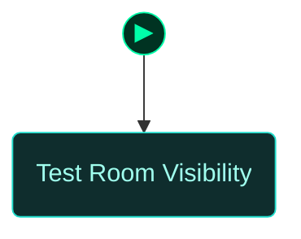
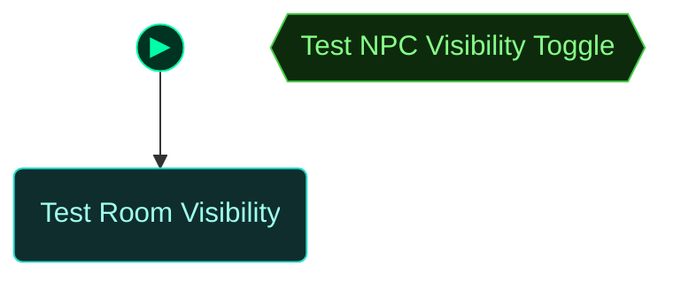
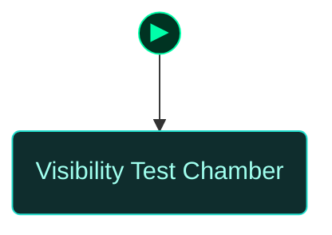
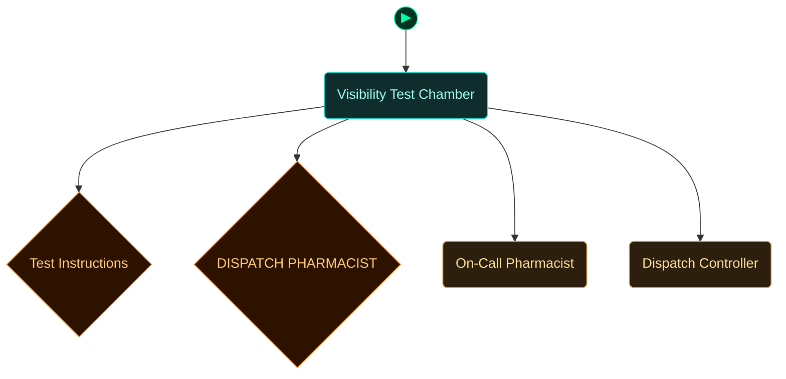

<!-- Auto-generated by scripts/generate_dungeon_graph.rb — do not edit by hand -->

# test_npc_visibility — Scenario Graph Reference

NPC VISIBILITY TEST (Phase 3)

This scenario tests the setVisible action for delayed NPC appearance.

TEST PROCEDURE:
1. Game starts — observe room
2. Pharmacist NPC is NOT visible initially (initiallyHidden=true)
3. Interact with DISPATCH BUTTON
4. This triggers 'pharmacist_dispatch' global = true
5. OBSERVE: Pharmacist NPC suddenly appears in the room
6. Pharmacist begins patrol cycle (Station → Location1 → Location2)
7. Pharmacist says: 'Pharmacist on call, reviewing dispensary status'

EXPECTED BEHAVIOR:
- Pharmacist starts completely hidden (alpha=0, no collision)
- When global is set, NPC becomes visible (alpha=1) and interactive
- Physics body and interaction system activate
- NPC begins normal patrol behavior

TEST DURATION: 1 minute

KEY VALIDATION:
✓ NPC hidden at start (not visible, not interactable)
✓ setVisible action triggers reveal
✓ Transition is immediate (not faded in)
✓ NPC becomes fully interactive after reveal
✓ Patrol behavior starts correctly

NOTE: This tests the setNPCVisible() handler in npc-manager.js
and the initiallyHidden property in npc-behavior.js

## Scenario Statistics

| Metric | Value |
|---|---|
| Story aims | 1 |
| Total tasks | 4 (0 optional) |
| VM flag challenges | 0 |
| Physical locks | 0 |
| AND-gate convergences | 0 |
| Rooms | 0 |
| Puzzle graph nodes / edges | 0 / 0 |
| Story graph nodes / edges | 1 / 0 |

## Critical Path

0 hops through story aims — minimum mandatory sequence to reach mission completion:

****

## How to Read These Diagrams

| Shape | Colour | Meaning |
|---|---|---|
| Rounded rectangle | Teal | Room / physical area |
| Rectangle | Red | Lock, barrier, or interactive terminal |
| Diamond | Orange | Inventory item or credential |
| Diamond | Red/Pink | NPC or physical key |
| Diamond | Purple | VM flag (challenge completion token) |
| Rectangle | Blue | VM challenge |
| Ribbon | Amber | NPC conversation / action gate |
| Hexagon | Green | Story aim (objective) |
| Hexagon | Amber | Critical path node |
| Circle | Grey | AND gate (all inputs required) |
| Subroutine rect `[[…]]` | Green | Container (holds items) |
| Rounded rectangle | Amber | NPC in room (Rooms & Contents only) |

Edges: `-->` solid = hard dependency; `-.->` dashed = soft / narrative dependency or optional path.

The `▶` node marks the player's starting room.

## Puzzle Graph

Physical lock–key dependency chain. Shows which items, codes, and NPC interactions are required to open each lock, and which locks gate access to each room or object. Use this to trace solvability, spot circular dependencies, and check that every key is reachable before the lock that needs it.

## Story Aims

Narrative objective flow. Shows story aims and their unlock conditions. Critical path aims are highlighted in amber. Use this to check aim sequencing, identify gaps between objectives, and verify that the player always has a clear next goal.

## Story + Puzzle (Integrated)

Puzzle graph and story aims combined, with bridge edges connecting physical puzzle progress to story aim completion. Use this to verify that physical actions drive narrative progress and that no aim is left floating without a puzzle prerequisite.

## Rooms

Physical room layout with all connections. Locked rooms are shown in red. Use this to check room reachability, identify dead-end rooms with no content, and understand the spatial structure of the scenario.

## Rooms & Contents

Physical room layout with all objects, containers, NPCs, and held items. Use this to check clue distribution across rooms, verify that hints are placed before the locks they solve, and spot rooms that are under- or over-loaded with content.

